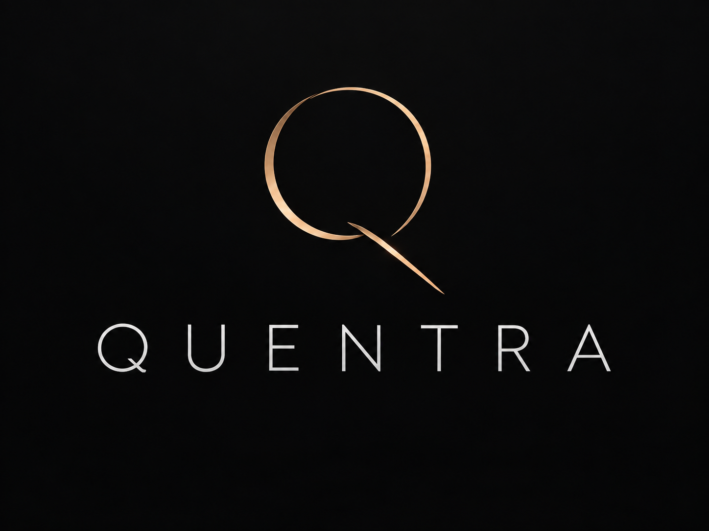

<p align="center"></p>

# Quentra

Traceable concrete and reinforcing-steel quantity takeoff from ETABS. Development has started with a portable .NET 10 calculation core and a command-line snapshot workflow.

**Current milestone:** Offline takeoff foundation. Frames, slabs, walls, openings, story allocation, supplied reinforcement, overrides, review and export run from saved snapshots. This is a development tool, not a live ETABS integration or a production quantity report.

## Run the examples

Install the .NET 10 SDK, then from the repository root:

```sh
dotnet build Quentra.slnx --configuration Release
dotnet test Quentra.slnx --configuration Release --no-build
dotnet run --project src/Quentra.Cli --configuration Release --no-build -- calculate fixtures/synthetic/takeoff.json output/takeoff-run.json
dotnet run --project src/Quentra.Cli --configuration Release --no-build -- replay output/takeoff-run.json output/takeoff-replayed.json
dotnet run --project src/Quentra.Cli --configuration Release --no-build -- export output/takeoff-run.json output/takeoff-report
```

In this workspace a local SDK is installed at `.tools/dotnet/dotnet`. To use it without modifying your machine's configuration:

```sh
export DOTNET_CLI_HOME="$PWD/.tools/cli-home"
export NUGET_PACKAGES="$PWD/.tools/nuget"
export DOTNET_CLI_TELEMETRY_OPTOUT=1
.tools/dotnet/dotnet build Quentra.slnx --configuration Release
.tools/dotnet/dotnet test Quentra.slnx --configuration Release --no-build
```

## Commands

```
quentra calculate <snapshot.json> <new-run.json>
quentra replay    <saved-run.json> <new-run.json>
quentra override  <run.json> <overrides.json> <new-run.json>
quentra accept    <run.json> <new-run.json> --reviewer <name> --note <text> --acknowledge <CODE,...> [--partial]
quentra export    <run.json> <new-directory>
```

- `calculate` and `replay` detect the schema: **1** is the frame-concrete format ([frames.json](fixtures/synthetic/frames.json)); **2** is the takeoff format ([takeoff.json](fixtures/synthetic/takeoff.json)). `override`, `accept` and `export` require schema 2 runs.
- `replay` verifies the package hash, recomputes every quantity and checks that the stored results reproduce.
- `override` applies a JSON array of recorded changes (dimension or thickness replacement, or exclusion). Each override names its author, reason and date, the original value, and the run's snapshot SHA256, which every command prints. Source values are retained; overrides apply to the effective model only, and an accepted run returns to Draft.
- `accept` requires a named reviewer, a note, and every current warning code acknowledged. A partial run can only be accepted with `--partial` and is labelled `AcceptedPartial`. Acceptance is blocked until the measurement policy is approved.
- `export` verifies the run, then writes a new directory containing `run.json`, one CSV per report table, `report.xlsx`, and `manifest.json` with SHA-256 hashes of every file.

The synthetic takeoff fixture produces **18.408 m³** gross and **17.808 m³** opening-adjusted modeled concrete, and **1,297.505 kg** of known steel. Steel is partial because beam B1 declares a required transverse component with no source. The frame fixture produces **1.656 m³**. The design document's §33 validation fixtures are in [fixtures/validation](fixtures/validation/README.md) and all reproduce their hand-calculated values.

Outputs must be new paths; existing runs and reports are never overwritten. Exit code 0 means the operation succeeded, including a valid draft with partial quantities. Inspect coverage and warnings; success does not mean engineering acceptance. Codes 1, 2 and 130 indicate input/IO/validation failure, usage error and cancellation respectively.

## Implemented

- Rectangular straight prismatic beams and rectangular/circular columns, using true 3D axis length.
- Planar slabs and walls in their own local plane, with planarity and self-intersection checks. Openings are unioned and clipped to the host before deduction (1 µm clipping precision).
- Gross and opening-adjusted modeled volumes, kept separate. Member intersections remain included; net, BOQ and procurement quantities are unavailable.
- Story allocation: sloped and vertical frames and walls are split by elevation band; slabs use their assigned story; anything outside declared bands is reported as `Unallocated`, never dropped.
- Reinforcement only from supplied, approved inputs: verified longitudinal design demand (station integration over a declared domain), assigned straight bars, distributed area intensity, volume fraction, and kg/m³ estimates. Evidence types stay separate. No default ratios, laps, anchorage or waste are inferred.
- Required steel components declared per element; complete steel is null while any component is missing. Demand requires verified current design evidence and is marked stale by dimension overrides.
- Warnings for unverified areas, invalid geometry, coincident frames, overlapping coplanar areas, unallocated volume and unapproved policy.
- Metre, millimetre, foot and inch inputs; SI calculations.
- Strict versioned JSON, unique identities, canonical ordering, SHA-256 integrity checks, replay, atomic writes, and formula-safe CSV/Excel text.

Hashes detect changes relative to stored contents; they are not digital signatures or engineer approval. The source snapshot hash includes its capture metadata. Reordering inventory does not change the hash.

## Not implemented yet

Live ETABS extraction, WPF desktop UI, net concrete, curved or non-prismatic frames, shear/transverse demand conversion, reinforcement extraction from ETABS, and Windows packaging. An `Etabs` source label in an imported snapshot is a source declaration, not compatibility certification. All current fixtures are synthetic; no engineering policy or quantity has been accepted by a structural engineer.

The core and CLI run independently of ETABS on platforms supported by .NET 10. Live CSI integration and WPF development require a licensed Windows ETABS test environment and verification of the exact build/runtime/code combination.

## Structure

| Project | Responsibility |
|---|---|
| `Quentra.Core` | Source records, SI quantity types, frame and planar geometry, steel calculation |
| `Quentra.Application` | Snapshot validation, takeoff engine, story allocation, coverage, overrides |
| `Quentra.Infrastructure` | JSON persistence, canonical ordering, hashes, replay, review, CSV/Excel export |
| `Quentra.Cli` | Offline calculate/replay/override/accept/export workflow |
| `Quentra.Tests` | Calculation, validation, persistence, review and export tests |

Runtime packages: [Clipper2](https://github.com/AngusJohnson/Clipper2) (polygon clipping, in Core) and [ClosedXML](https://github.com/ClosedXML/ClosedXML) (Excel, in Infrastructure). No CSI assemblies are bundled. The ETABS adapter and desktop projects will be added when their implementation starts.

Schema 2 snapshots contain the frame model plus areas, story bands, per-element metadata (material and section names, optional story, required steel components), reinforcement inputs and a measurement policy. See [takeoff.json](fixtures/synthetic/takeoff.json). Malformed JSON, unknown enum values, duplicate IDs, broken references, overlapping stories and inconsistent steel scopes reject the snapshot. Missing or unverifiable geometry produces unknown quantities instead. Inputs are limited to 16 MiB.

## Project documents

- [Design specification](quentradesigndoc.md)
- [Roadmap and acceptance gates](QUENTRA_ROADMAP.md)
- [Development status and next tasks](docs/DEVELOPMENT_STATUS.md)
- [Structural engineer meeting brief](docs/ETABS_Structural_Engineer_Meeting_Brief.md)

The next step is Windows API exploration alongside further offline development. Synthetic test success does not complete the live ETABS compatibility gate.
