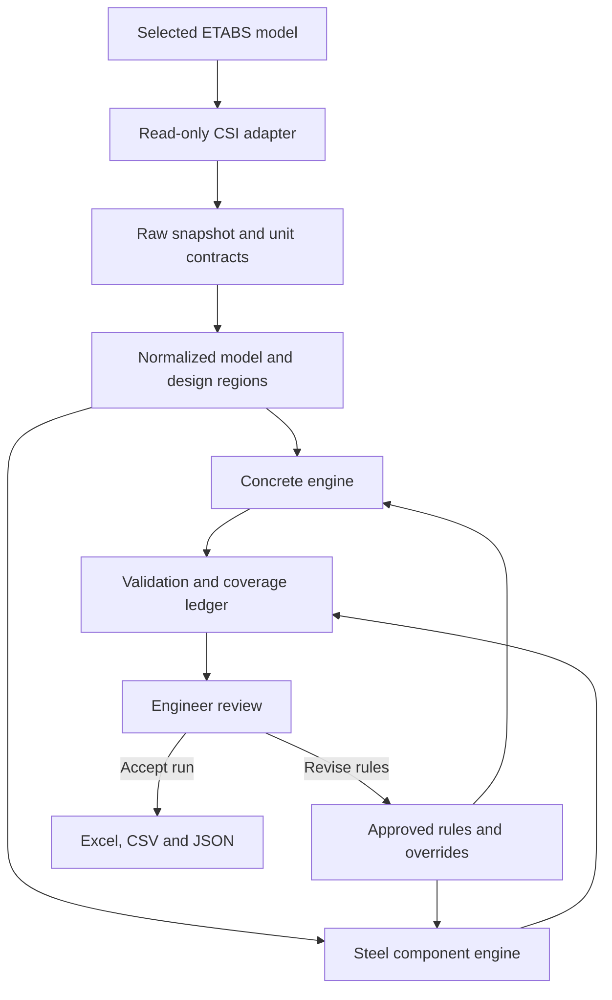

# ETABS concrete and reinforcing-steel quantity takeoff

## Technical and implementation specification — review draft 1.0

**Prepared:** 26 September 2026. **Status:** planning only; no application implementation. **Audience:** software developer and reviewing structural engineer.

The recommended product is a Windows desktop application that attaches to a selected, running ETABS instance and extracts an immutable model snapshot. It calculates concrete from supported object geometry and reports reinforcement in explicitly separate categories: design-demand equivalent, model-assigned, estimated, and drawing/detail-derived. Start with ETABS 22 as the minimum proposed production family, subject to testing of exact builds. Use a C# core with a replaceable CSI adapter and WPF interface.

**The program must never hide an engineering assumption.** A number without its measurement basis, source, coverage and exclusions is not a complete quantity result. Missing reinforcement is unknown, never zero. A total of gross modeled volumes is not a net construction quantity.

### Evidence and specification conventions

- **D — documented:** a capability appears in the cited official CSI documentation. Much public method documentation is for ETABS 2016; this establishes a historical contract, not certification for versions 19–23.
- **V — verification item:** exact method signature, availability, units, meaning or behavior must be checked in the installed `CSI API ETABS v1.chm`, assembly and a controlled ETABS model.
- **P — proposed rule:** an application design or measurement decision recommended here, subject to engineer approval where indicated.
- **Unavailable in this research:** no running Windows ETABS instance, licensed model or current installed API help was supplied. No API experiments or structural-design checks have been performed. The experiment register in §30 is a release gate, not completed validation.

Source IDs [S01]–[S27] resolve to official documentation links in the references. Equations, architecture and proposed rules are this specification's recommendations, not CSI promises. Approval fields remain deliberately blank.

### Contents

- [1. Project objective and staged scope](#1-project-objective-and-staged-scope)
- [2. Required outputs and proposed data schema](#2-required-outputs-and-proposed-data-schema)
- [3. ETABS API architecture and evidence map](#3-etabs-api-architecture-and-evidence-map)
- [4. Recommended application architecture](#4-recommended-application-architecture)
- [5. Concrete quantity methodology](#5-concrete-quantity-methodology)
- [6. Reinforcing-steel quantity methodology](#6-reinforcing-steel-quantity-methodology)
- [7. Preventing double counting](#7-preventing-double-counting)
- [8. Units strategy](#8-units-strategy)
- [9. Conceptual C# domain model](#9-conceptual-c-domain-model)
- [10. Extraction workflow](#10-extraction-workflow)
- [11. Classification hierarchy](#11-classification-hierarchy)
- [12. Geometry support matrix](#12-geometry-support-matrix)
- [13. Reinforcement conversion algorithms](#13-reinforcement-conversion-algorithms)
- [14. Accuracy and evidence classification](#14-accuracy-and-evidence-classification)
- [15. Validation strategy](#15-validation-strategy)
- [16. User interface and workflow](#16-user-interface-and-workflow)
- [17. Reporting and export](#17-reporting-and-export)
- [18. Configuration](#18-configuration)
- [19. Logging and diagnostics](#19-logging-and-diagnostics)
- [20. Performance design](#20-performance-design)
- [21. Testing strategy](#21-testing-strategy)
- [22. ETABS version compatibility](#22-etabs-version-compatibility)
- [23. Error handling](#23-error-handling)
- [24. Security and stability](#24-security-and-stability)
- [25. Recommended technology stack](#25-recommended-technology-stack)
- [26. Development roadmap and acceptance gates](#26-development-roadmap-and-acceptance-gates)
- [27. Major technical risks](#27-major-technical-risks)
- [28. Engineering decisions before implementation](#28-engineering-decisions-before-implementation)
- [29. Realistic MVP definition](#29-realistic-mvp-definition)
- [30. Final recommended system design and investigation backlog](#30-final-recommended-system-design-and-investigation-backlog)
- [31. Structural engineering / civil requirements review](#31-structural-engineering--civil-requirements-review)
- [32. Structural engineer meeting deliverable](#32-structural-engineer-meeting-deliverable)
- [33. Engineering validation before coding](#33-engineering-validation-before-coding)
- [34. Core engineering principle and production gate](#34-core-engineering-principle-and-production-gate)

## 1. Project objective and staged scope

Enable structural engineers, quantity surveyors and design-office estimators to obtain repeatable, reviewable RC quantities from the model they already maintain. Replace repeated copying of section dimensions, manual volume calculations and untraceable spreadsheet steel allowances. Preserve the distinction between the analysis model and the building that will be constructed.

| Stage     | Required scope                                                                                                                                                                                                                                                                                                                                                  | Explicit boundary                                                                                                                                                        |
| --------- | --------------------------------------------------------------------------------------------------------------------------------------------------------------------------------------------------------------------------------------------------------------------------------------------------------------------------------------------------------------- | ------------------------------------------------------------------------------------------------------------------------------------------------------------------------ |
| MVP       | Attach to running ETABS; rectangular straight beams; rectangular/circular straight columns; planar uniform solid slabs and walls; coplanar openings; gross modeled and opening-adjusted volumes; story/category/material summaries; approved ratio estimates; beam/column longitudinal demand equivalents where verified; warnings; review; Excel, CSV and JSON | No claim of full net building concrete; no automatic code detailing; incomplete steel visibly partial; one certified ETABS family/build and design-code subset initially |
| Version 1 | Certified builds in 22/23; verified physical placement and deterministic joint deduction for supported solids; provided column cage equivalents; selected wall/slab result-table adapters; drop zones; approved modeled mats; improved override/review history                                                                                                  | Each advanced feature has its own capability and acceptance gate; no universal BBS promise                                                                               |
| Future    | 19–21 legacy adapter if demanded; SAFE integration; complex non-prismatic/curved/layered geometry; imported BBS/BIM layouts; code-specific detailing; pours/zones; PDF; database/Power BI; embodied carbon                                                                                                                                                      | Additional models and material factors must have provenance; cross-product API similarities do not establish identical semantics                                         |

The primary MVP use is **design-stage estimating and model quantity reconciliation**. Tender or commercial BOQ use requires an approved measurement standard; construction procurement requires detailing and allowance information beyond the MVP.

## 2. Required outputs and proposed data schema

Use normalized records with stable keys, then flatten them for reports. Do not force an entire member's changing reinforcement into one `ReinforcementArea` field.

| Record / field group    | Essential fields                                                                                                                                          | Optional or conditional fields                                                                                        |
| ----------------------- | --------------------------------------------------------------------------------------------------------------------------------------------------------- | --------------------------------------------------------------------------------------------------------------------- |
| Run                     | RunId, schema/calculation version, timestamp, model identity, ETABS build, adapter version, source units, settings hash, snapshot hash, run/review status | Model file hash if saved/accessible; design-run identity if exposed; reviewer                                         |
| Element                 | RunId, internal ElementId, unique ETABS object name, object kind, inclusion status, classification and basis, property/material keys                      | ETABS GUID when available; human label; group/zone/pour; tower                                                        |
| Geometry                | Raw source reference, normalized points/connectivity, section shape/dimensions or polygon/thickness, local axes, geometric support status                 | Offsets, insertion point, curved path, thickness zones, physical solid                                                |
| Story allocation        | ElementId, allocation id, story key, allocation rule, allocated volume or segment limits                                                                  | Tower; ownership boundary elevation; user override                                                                    |
| Material                | Material key/name/type, source reference                                                                                                                  | Concrete strength and strength basis; reporting grade; steel yield strength; mass density; source of grade mapping    |
| Concrete quantity       | GrossModeledVolumeM3, OpeningDeductionM3, OpeningAdjustedVolumeM3, method, assumptions, status                                                            | JointDeductionM3, NetPhysicalVolumeM3, BOQVolumeM3, procurement volume; null when not supported                       |
| Reinforcement component | Element/design-region key, component, direction/face, source category, method, mass/volume nullable, completeness, assumption ids                         | Station interval, AsM2 or AsPerWidthM2PerM, bar size/count/spacing, grade, equivalent bar length, detailing additions |
| Design evidence         | Result family, design code/edition, design/check mode, result status, source reference                                                                    | Governing combination per station/component; design section; errors; freshness evidence                               |
| Warning                 | Code, severity, affected elements/components, engineering consequence, recovery, disposition                                                              | Raw API error linkage                                                                                                 |
| Override                | Original value and unit, replacement and unit, reason, user/time, snapshot binding                                                                        | Approval, superseded override id                                                                                      |

Source references contain method or table key, field names, raw row/station identifiers, raw values and units, extraction timestamp and raw-data hash. Geometry, section dimensions, concrete strength and bar sizes retain their original representations. A material called “C40” does not establish cylinder/cube strength or a code grade without review.

Display length, width, depth/thickness, area, gross/opening-adjusted/net volume, longitudinal steel, transverse steel, other steel, total known steel, completeness, method and warnings. Unknown and not-applicable are distinct. Store volume ratios as fractions and kg/m³ as a different measure; never use one untyped `Ratio` for both.

Summaries group by story, category, concrete grade, reinforcement grade, section, method and review status. Include found/in-scope/included/excluded/estimated/unquantified counts, known concrete volume coverage and missing-steel component counts. `KnownSteelMassKg` can be totaled; `CompleteSteelMassKg` remains null if any required component is unknown. An optionally approved blended estimate must still expose its demand-derived and estimated contributions. Ratios use summed mass/volume, not arithmetic means of element ratios.

## 3. ETABS API architecture and evidence map

The root object is `cOAPI`, with `SapModel` providing object, property, story and result access. Prefer ETABS-specific `ETABSv1.dll` inside one adapter. CSI documents cross-product API development, but that is a future portability option [S01].

| API area / likely calls                                                                                        | Purpose and information                                | MVP?                  | Evidence and limits                                                                                                                                                         |
| -------------------------------------------------------------------------------------------------------------- | ------------------------------------------------------ | --------------------- | --------------------------------------------------------------------------------------------------------------------------------------------------------------------------- |
| `cHelper.GetObject`; `GetObjectProcess`; `cOAPI.SapModel`                                                      | Attach to selected running model                       | Yes                   | D: process-id attachment introduced in 20.2 [S02]; V: runtime/registration and process selection                                                                            |
| `SapModel.GetVersion`, `GetModelFilename`, `GetModelIsLocked`                                                  | Model/build/state                                      | Yes                   | D [S03]; lock is not proof of current design                                                                                                                                |
| `GetPresentUnits_2`, `GetDatabaseUnits_2`                                                                      | Present and stored units                               | Yes                   | D [S03,S04]; interpret each output contract separately                                                                                                                      |
| `Story.GetStories`                                                                                             | Names/elevations/heights                               | Yes                   | D [S05]; V: newer overloads and towers; do not expand similar-story flags into new geometry                                                                                 |
| `PropMaterial.GetNameList`, `GetMaterial`, `GetOConcrete`, `GetORebar`, `GetWeightAndMass`                     | Material type, strengths, densities                    | Yes                   | D method family [S06]; V: overloads/temperature fields and effective material overwrites                                                                                    |
| `FrameObj.GetAllFrames`, `GetNameList`, `GetPoints`, `GetSection`                                              | Member inventory, connectivity, properties             | Yes                   | D [S07]; batch data may require supplemental reads                                                                                                                          |
| `FrameObj.GetGUID`, `GetLabelFromName`, `GetDesignOrientation`, `GetDesignProcedure`                           | Identity, story, classification                        | Yes                   | D [S07]; GUID persistence across copy/import must be tested                                                                                                                 |
| `GetInsertionPoint`, `GetEndLengthOffset`, `GetLocalAxes`, `GetMaterialOverwrite`                              | Placement, offsets, effective material                 | Yes, detect           | D [S07]; analysis offsets are not automatic concrete deductions                                                                                                             |
| `PropFrame.GetTypeOAPI`, `GetRectangle`, `GetCircle`, `GetSectProps`, `GetNonPrismatic`                        | Cross-section and variation                            | Yes, simple shapes    | D [S08]; stiffness/effective area may differ from concrete solid area                                                                                                       |
| `PropFrame.GetRebarBeam`, `GetRebarColumn`; `PropRebar`                                                        | Assigned reinforcement definitions/bar catalogue       | Read where supported  | D [S09,S10]; definitions do not establish construction detailing                                                                                                            |
| `AreaObj.GetAllAreas`, `GetPoints`, `GetProperty`, `GetGUID`, `GetLabelFromName`                               | Shell object polygons and identity                     | Yes                   | D [S11]; analysis mesh not a second inventory                                                                                                                               |
| `AreaObj.GetOpening`, `GetDesignOrientation`, `GetLocalAxes`, `GetPier`, `GetSpandrel`, `GetMaterialOverwrite` | Void status, role, placement/design-region labels      | Yes                   | D [S11]; overlapping opening association requires geometry                                                                                                                  |
| `PropArea.GetSlab`, `GetWall`, property type getters                                                           | Slab/wall types, thickness, material                   | Yes                   | D family [S12]; V: exact version methods, overrides, layered and variable thickness                                                                                         |
| `PointObj.GetCoordCartesian`, connectivity getters; object `GetElm`                                            | Global coordinates and object–analysis-element mapping | Yes                   | D family; V: bulk alternatives and returned coordinate system; retain all mapping evidence                                                                                  |
| `DesignConcrete.GetSummaryResultsBeam`                                                                         | Station-based required reinforcement                   | Conditional           | D [S13]; component-specific units and errors                                                                                                                                |
| `DesignConcrete.GetSummaryResultsColumn`                                                                       | Design As or check utilization, shear demand           | Conditional           | D [S14]; check-mode utilization is not steel area                                                                                                                           |
| `DesignConcrete.GetResultsAvailable`, `GetDesignSection`, design-code getters                                  | Result existence and section reconciliation            | Conditional           | V: installed signature; existence is not freshness                                                                                                                          |
| `DesignShearWall` result methods                                                                               | Pier/spandrel demand and boundary requirements         | V1                    | V: exact result retrieval methods not verified here; do not invent `GetSummaryResultsWall`                                                                                  |
| `AreaObj.GetRebarDataPier`, `GetRebarDataSpandrel`                                                             | Layer/count/spacing/zone data                          | Exploration           | D [S15,S16]; V: assignment origin, wall-hinge/detailing semantics, units and completeness                                                                                   |
| Concrete slab/design-strip/result interfaces                                                                   | Strip or FE-based slab design data                     | V1                    | ETABS design workflows D [S17,S18]; exact extraction method/availability V                                                                                                  |
| `DatabaseTables`                                                                                               | Broader bulk model/design data                         | Explore in phase 0    | D family in release notes [S02]; candidate calls `GetAvailableTables`, `GetAllTables`, `GetAllFieldsInTable`, `GetTableForDisplayArray` require installed-help verification |
| Analysis `Results`                                                                                             | Forces/stresses for diagnostics                        | No core quantity need | Analysis force/stress output is not reinforcement demand or steel mass                                                                                                      |

API verification must cover shell physical thickness and material overrides, not merely nominal property thickness. Any unresolved physical-property override blocks an “exact modeled geometry” label for that object.

### Reinforcement data categories

| Data category                    | What it establishes                                      | What it does not establish                                         |
| -------------------------------- | -------------------------------------------------------- | ------------------------------------------------------------------ |
| Geometry                         | Object coordinates and idealized section                 | As-built extents or unmodeled concrete                             |
| Section reinforcement definition | Model input, bar arrangement or design/check assumptions | Bar lengths, complete tie zoning or drawing approval               |
| Design reinforcement             | Demand at reported positions under a selected code       | Provided bars, laps, hooks, procurement                            |
| Detailed layout                  | Potential counts, spacing, layers, zones                 | Complete BBS unless bar paths and bends are present and reconciled |
| Database output                  | An alternate transport for model/result records          | Higher engineering accuracy merely because it is tabular           |

## 4. Recommended application architecture

| Option                    | ETABS-specific tradeoff                                                                                                     | Recommendation                              |
| ------------------------- | --------------------------------------------------------------------------------------------------------------------------- | ------------------------------------------- |
| In-process managed plugin | Convenient access to model; shares host process/runtime and crash/dependency risks                                          | Later thin launcher, not calculation engine |
| Standalone desktop        | Separate UI/reporting lifecycle; attach/select-instance issues and API interop still need testing                           | Primary application                         |
| Hybrid                    | Reuses core; small plugin can pass context to external tool                                                                 | V1/future when users need it                |
| COM/.NET integration      | Integration mechanism rather than competing product architecture; use CSI helper and supported interop                      | Isolate behind adapter                      |
| Python or web-only        | Useful for experiments; Python adds deployment/interop variability; browser cannot directly replace local ETABS integration | No strong reason to replace C#              |

**Proposed structure** (paths are design artifacts, not implemented projects):

| Project / folder                                                               | Responsibility                                                                              |
| ------------------------------------------------------------------------------ | ------------------------------------------------------------------------------------------- |
| `src/EtabsQuantity.Domain`                                                     | SI value objects, element/quantity records, provenance; no CSI or UI dependency             |
| `src/EtabsQuantity.Application`                                                | Run orchestration, policies, approvals, snapshots and cancellation                          |
| `src/EtabsQuantity.EtabsApi`                                                   | CSI reference, attachment, capability probes, return-code wrapper, serialized API execution |
| `src/EtabsQuantity.Extraction`                                                 | Raw DTOs, caches, object/result joins, table schema adapters                                |
| `src/EtabsQuantity.Geometry`                                                   | Planar polygons, holes, section area, story clipping; later solid ownership                 |
| `src/EtabsQuantity.Calculations`                                               | Concrete and reinforcement engines, component coverage, integration                         |
| `src/EtabsQuantity.Validation`                                                 | Geometry, units, design/result state and completeness rules                                 |
| `src/EtabsQuantity.Reporting`                                                  | Excel/CSV/JSON projections and traceable summaries                                          |
| `src/EtabsQuantity.Persistence`                                                | Immutable run files, settings, review/override records                                      |
| `src/EtabsQuantity.Desktop`                                                    | WPF MVVM, selection/filtering/review; no quantity equations in view models                  |
| `src/EtabsQuantity.Diagnostics`                                                | Structured logs and opt-in raw snapshots                                                    |
| `src/EtabsQuantity.EtabsHost`                                                  | Optional separate interop worker if runtime isolation is required                           |
| `tests/Unit`, `tests/AdapterContract`, `tests/Integration`, `tests/Regression` | Pure math, schemas, licensed ETABS fixtures, snapshots                                      |
| `docs/EngineeringRules`, `fixtures/ManuallyVerifiedModels`                     | Approved rules and expected quantities                                                      |

All ETABS access occurs through a single serialized session on a dedicated STA thread with appropriate message pumping, subject to CSI's current guidance. CPU-only calculation can run in parallel after extraction. No CSI objects cross into domain records. An external worker can improve client recovery but cannot make a blocking host API call intrinsically cancellable.

## 5. Concrete quantity methodology

Maintain separate measures:

- `Vgross`: sum of each supported modeled solid before void and joint deductions.
- `Vopen`: each object's geometry after applicable openings, before inter-object deductions.
- `Vnet`: union of reconstructed physical solids with openings removed, allocated once under an approved ownership rule.
- `Vboq`: measurement-standard quantity, which may deliberately ignore small voids or follow trade-specific conventions.
- `Vorder`: approved procurement allowance applied to an approved base; never overwrite base quantities.

Neither stiffness modifiers nor self-weight/mass modifiers scale geometric concrete volume. Do not subtract embedded reinforcement volume from ordinary concrete takeoff unless the selected measurement standard explicitly requires it.

| Element           | Base calculation                                                     | Required handling / support                                                                                                                                                                                                |
| ----------------- | -------------------------------------------------------------------- | -------------------------------------------------------------------------------------------------------------------------------------------------------------------------------------------------------------------------- |
| Column            | `A × norm(Pj−Pi)`; rectangle `bd`; circle `πD²/4`                    | Actual 3D length, not story-height shortcut. Story clipping allocates inclined/multistory members. Section changes require segments. Column–beam overlap retained in MVP gross, explicitly warned                          |
| Beam              | `A × Lpath` for prismatic straight section                           | Separate object length, verified physical path and approved clear length. End offsets and rigid zones describe analysis; do not deduct automatically. Placement affects joint intersection, even where volume is unchanged |
| Slab              | `∫Ω t(u,v)dA`; uniform `t × area(Ω minus holes)`                     | Compute actual surface area in local plane, not global XY projection. Disjoint thickness zones; opening union clipped to host. Do not add generated mesh areas                                                             |
| Wall / shear wall | Same polygon integral in wall plane; rectangle `length × height × t` | Deduct doors/windows once; clip multistory polygons; arbitrary planar inclined wall uses true surface. Pier/spandrel label is a design grouping, not extra concrete                                                        |
| Foundation        | Physical slab/frame geometry if genuinely modeled                    | Uniform mat/footing slab can use area method; ground beam uses frame method; springs, point supports and loads contain no footing volume                                                                                   |

### Geometric implementation rules

1. Read raw points, coordinate system, section placement and thickness assignments. Preserve source data.
2. Validate polygon closure, planarity and self-intersection. Establish a stable local plane; translate near a local origin to reduce floating-point loss.
3. Project to the plane; clip/union holes; triangulate concave polygons with holes or use a robust polygon-area method. Ring winding is a representation choice, not permission to return negative volume.
4. An explicit opening is not a negative concrete element. Associate by plane, spatial intersection, structural layer/host evidence and review. Do not deduct the same void again when surrounding solids already omit it.
5. Adjacent, differently thick slabs remain separate regions. A drop panel can mean full replacement thickness or extra depth: determine modeling intent before any subtraction. For replacement, `V = Abase*tbase + Adrop*(tdrop−tbase)` only where the base includes the drop footprint and depths align.
6. For later net quantities, reconstruct solids from physical section placement, perform ownership-based subtraction, then allocate stories. Do not use independent pairwise deductions: triple intersections otherwise over-deduct.
7. For a supported variable section, use `∫A(s)ds` with documented interpolation and numerical tolerance. Do not assume ETABS inertia interpolation means linear area variation. Defer unsupported haunches, tapers and general Section Designer geometry.

Simple modeled dimensions allow an exact mathematical result within numerical tolerance. Physical construction volume additionally needs confirmed extents, openings, intersections and omitted components. A general section's stiffness area alone is not necessarily its physical concrete area, especially for composite/equivalent sections.

## 6. Reinforcing-steel quantity methodology

### Method A — design results

The beam summary contract includes station locations, flexural top/bottom areas, longitudinal torsion area, shear area per length and transverse torsion area per length, with controlling combinations and messages [S13]. Treat flexure and torsion as separate demands until a code-specific combination rule is verified. A beam's steel demand equivalent is an integral of the adopted demand profile, not a bar schedule.

Column summaries distinguish design mode (required PMM steel area) from check mode (PMM utilization). Transverse demands can be reported for both axes [S14]. Never convert utilization to a steel percentage. For check mode, obtain the assigned cage separately and label it model-assigned, with approved length assumptions.

Wall design operates through pier/spandrel regions and can include boundary requirements [S19]. One region can cover multiple shell objects. Preserve region-level quantities until a justified allocation exists. Do not apply a whole-pier result to each component shell. Verify code-specific result fields, units, design/check status and whether boundary values are totals or additions.

ETABS supports strip-based and FE-based slab design; FE reinforcement directions follow slab local axes [S17,S18]. API extraction of the necessary fields remains V. Strip totals and reinforcement intensity are dimensionally different; no conversion proceeds until schema semantics, layer, width and region coverage are established.

### Method B — model-assigned reinforcement

Beam section getters return reinforcement materials, centroid covers and four end-area values [S09]. These are not continuous bar paths; do not infer a complete beam cage or clear cover to a stirrup from them.

Column section getters include layout, sizes, tie data and a design/check flag [S10]. A checked cage may support straight longitudinal mass; it still needs approved extent, splice, hook and tie-zone rules. Design-mode bar choices may be assumptions rather than final provided steel. Rectangular face counts must be interpreted without counting corners twice.

Pier/spandrel layer getters expose potentially useful bar/zone fields [S15,S16]. Their public parameter descriptions are incomplete. Verify whether data represent assigned nonlinear-hinge reinforcement, detailing or another model definition, and whether they correspond to the quantity region. Do not label them design results or final construction bars based only on method names.

### Method C — estimates

Use either volumetric fraction `r = Vs/Vc`, giving `M = r*Vc*ρs`, or intensity `q kg/m³`, giving `M = q*Vc`. Set `ρs = 7850 kg/m³` as a configurable project assumption. Store whether the ratio includes all bars or one component and the concrete-volume basis on which it was calibrated.

Do not ship universal numeric “reasonable ratios” as automatic defaults. Establish element-specific low/base/high values from engineer-approved historical BBS quantities for similar code, seismic system, height, span and loading. Beams need longitudinal/transverse separation; columns need confinement sensitivity; slabs need thickness, spans and support-strip distinctions; walls need web/boundary separation; foundations need type, thickness and punching conditions. Require a sample count, source projects, exclusions and approval date. Uncalibrated elements stay unquantified until a ratio is entered. The examples in §33 illustrate arithmetic, not recommended design ratios.

If an all-in ratio replaces an element's reinforcement, do not add demand steel again. If only ties are estimated, its calibration must exclude longitudinal bars. Allow low/base/high scenarios but do not present them as statistical confidence bounds without a statistical basis.

### Method D — database tables

Use table extraction when it gives bulk or otherwise unavailable records. Enumerate tables/fields, record table version and units, and map fields by stable keys, not display positions or translated captions. The proposed table families to investigate are concrete beam/column design, pier/spandrel design, slab strips/FE reinforcement, assignments, reinforcement definitions and object–element mappings; these are search categories, not guaranteed literal table keys.

Direct getters offer clearer typed contracts and fewer locale problems. Tables may reduce calls and improve coverage but add schema, filtering, unit, locale and flattened-array risks. Both routes require matching results to the correct object/design region. Verify direct-vs-table parity on a fixture; use one authoritative route per component, not their sum.

## 7. Preventing double counting

Use **object-level geometry** as the canonical concrete inventory. Analysis elements are a mapping/diagnostic source and, later, a partition for slab design integration. Never combine object volumes with their meshed descendants.

| Case                                  | Required strategy                                                                                                                       |
| ------------------------------------- | --------------------------------------------------------------------------------------------------------------------------------------- |
| Automatic shell mesh / line elements  | Map to parent; do not create additional material records                                                                                |
| User-divided frames/areas             | These are real object records; count disjoint geometry, retain parent lineage if known                                                  |
| Repeated labels                       | Key by model/run + unique object name/kind; story label alone is unsafe                                                                 |
| Coincident duplicates                 | Geometry/section/material fingerprint identifies candidates; engineer decides intentional layering versus duplicate. No silent deletion |
| Partially overlapping slabs/walls     | Flag in MVP. V1 partition by verified physical layer and thickness; same plane does not prove same material solid                       |
| Beam-column / slab-wall / wall-column | MVP gross warning. V1 ordered solid ownership or union; one ledger entry per removed region                                             |
| Story boundaries                      | Allocate each concrete fragment once; slabs owned by assigned level; vertical members clipped into level intervals                      |
| Wall regions / coupling beams         | Design labels do not generate concrete. Choose frame or spandrel steel source per physical component                                    |
| Openings                              | Union eligible voids; intersect with remaining host footprint; no repeated subtraction                                                  |

Proposed net ownership: foundations first at their interfaces; above them columns, walls excluding columns, slabs excluding vertical elements, then beam portions outside those solids. This produces downstand/upstand beam increments where slab overlap exists. The engineer can change trade allocation; the geometric union total must remain invariant when only ownership changes. Gross and net reports must never mix silently.

## 8. Units strategy

Internal units: metres, m², m³, newtons, pascals and kilograms. Report “steel mass” in kg or tonnes; reserve weight in newtons for a force quantity. Store temperature units when relevant to source material data.

Read present units and database units; CSI distinguishes stored database units from present units [S04]. Build a **field-level unit contract**: geometry length, reinforcement area, area-per-length, stress, density and dimensionless values. Do not assume every table field follows the visible ETABS unit selector.

`UnitConverter` comprises `SourceUnitContext`, typed dimensions (`Length`, `Area`, `Volume`, `Stress`, `MassDensity`, `RebarIntensity`), a versioned API/table field registry and invariant numeric parsing. Normalize once during extraction; calculations accept only SI DTOs. Preserve source value/unit and conversion factor. Output formatting alone handles mm, feet, tonnes and rounding.

Examples: `1000 mm² = 0.001 m²`; `1000 mm²/m = 0.001 m²/m`; `1 mm²/mm = 0.001 m²/m`. Area and area-per-length cannot share a converter. Convert kN/m³ to kg/m³ only with an explicit gravitational-acceleration convention; do not treat force density as mass density.

Prefer no `SetPresentUnits`. Snapshot units before/after each extraction stage; discard a stage if they change. A user must avoid editing during extraction because repeated unit reads cannot prove atomicity. If a verified route requires temporary display/filter changes, make it an explicit opt-in mode, snapshot/restore in `finally`, report restoration failure and test for model-dirty side effects. Strict read-only mode refuses that route. Unknown unit contract blocks that field's quantity.

## 9. Conceptual C# domain model

These are design signatures/property sketches, not a complete implementation. Immutable records are preferred after normalization; use typed SI values rather than ambiguous doubles.

| Class / interface                                       | Responsibility and important properties                                                                                 |
| ------------------------------------------------------- | ----------------------------------------------------------------------------------------------------------------------- |
| `EtabsModelInfo`                                        | ModelKey, FileName, ETABSVersion, APIVersion, ProcessId, IsLocked, source units, design codes, SnapshotId, capture time |
| `StoryInfo`                                             | StoryId, Name, TowerId, ElevationM, BelowElevationM, HeightM; geometry allocation convention                            |
| `StructuralElement`                                     | ElementId, EtabsName, Guid?, Label?, Kind, ClassificationBasis, MaterialId, SectionId, inclusion, provenance            |
| `FrameElement : StructuralElement`                      | Endpoints, AxisLengthM, LocalAxes, Offsets, InsertionPoint, section segments                                            |
| `BeamElement : FrameElement`                            | Usage subtype, support refs, measurement length, reinforcement stations                                                 |
| `ColumnElement : FrameElement`                          | Story intervals, cage-definition ref, design/check mode                                                                 |
| `SlabElement : StructuralElement`                       | Plane, polygon, hole refs, thickness regions, type, local directions                                                    |
| `WallElement : StructuralElement`                       | Plane/polygon/thickness, pier/spandrel keys, boundary regions                                                           |
| `MaterialInfo`                                          | RawName, Type, ConcreteStrengthPa?, StrengthBasis?, RebarYieldPa?, DensityKgM3?, reporting grade mapping                |
| `SectionInfo`                                           | ShapeType, dimensions, physical area?, material, nominal/effective thickness, support status                            |
| `ConcreteQuantity`                                      | Gross, OpeningAdjusted, Net?, BOQ?, deduction ledger, method, basis, coverage, assumptions                              |
| `ReinforcementQuantity`                                 | Component list, KnownMassKg, CompleteMassKg?, scope, source, geometry/rebar evidence classes                            |
| `RebarComponentQuantity`                                | Longitudinal/transverse/web/boundary/etc., interval/region, direction/face, quantity?, grade?, allowances, completeness |
| `QuantitySummary`                                       | Group keys, quantity basis, method subtotals, counts, coverage denominators, unquantified count                         |
| `CalculationWarning`                                    | Code, severity, ElementId?, Component?, engineering consequence, resolution, acknowledgment                             |
| `SourceReference`                                       | API method/table/field, row ids, raw payload hash, raw units, capture context                                           |
| `Assumption`, `OverrideRecord`, `ReviewRecord`          | Versioned engineering decisions, before/after values, reason and approval; bound to snapshot/settings                   |
| `DesignRegion`, `StoryAllocation`, `DeductionRecord`    | Many-to-many result mapping; one-time allocations; intersection ownership audit                                         |
| `IModelExtractor`                                       | Session → immutable raw/normalized snapshots plus extraction diagnostics                                                |
| `IConcreteCalculator`, `IReinforcementCalculator`       | Snapshot + approved rules → component quantities/warnings; no ETABS calls                                               |
| `IUnitConverter`, `IQuantityValidator`, `IReportWriter` | Typed normalization; validity/coverage; deterministic export                                                            |
| `IDetailingPolicy`                                      | Future code/edition/jurisdiction-specific lap, anchorage, minimum and shape rules                                       |

One element may have several story allocations and several reinforcement components, each with different evidence. A region-to-element allocation is an explicit derived relationship, never an implicit duplication.

## 10. Extraction workflow

Calls below use the evidence/verification status in §3. Never start analysis or design as a side effect of extraction.

| Step                    | Input → expected output                                   | Likely API route                                                    | Failure and response                                                                                         |
| ----------------------- | --------------------------------------------------------- | ------------------------------------------------------------------- | ------------------------------------------------------------------------------------------------------------ |
| 1. Select instance      | Running processes/user selection → explicit target        | CSI helper; process attachment where supported                      | No running instance: ask user to open ETABS; ambiguity: show selector                                        |
| 2. Attach               | Target → session and SapModel                             | `GetObjectProcess` / `GetObject`                                    | COM/runtime/privilege mismatch: actionable connection error                                                  |
| 3. Identify model       | Session → version, path, state, inventory counts          | `GetVersion`, `GetModelFilename`, `GetModelIsLocked`, object counts | Blank filename may mean unsaved model, not necessarily no model; inspect inventory and flag unsaved identity |
| 4. Capability check     | Build/adapter → capability manifest                       | Version plus harmless getter probes                                 | Unsupported required capability stops; optional result feature disabled                                      |
| 5. Capture context      | Model → units, code, filters, snapshot header             | Unit getters; design-code/state getters V                           | Unknown units stop; busy model defer                                                                         |
| 6. Stories              | Model → story/tower map                                   | `Story.GetStories`; tower route V                                   | Missing/ambiguous elevations: unallocated bucket or stop story report                                        |
| 7. Materials            | Referenced names → effective material records             | `PropMaterial` plus object overwrites                               | Missing material skips affected quantity; no concrete yields explicit empty scope                            |
| 8. Frames               | Model → unique frames and source connectivity             | `GetAllFrames` or name list + getters                               | Nonzero status/array mismatch: discard batch or affected record                                              |
| 9. Frame properties     | Unique sections → cached dimensions and rebar definitions | `PropFrame` type-specific getters                                   | Unsupported section marks excluded; do not substitute rectangle                                              |
| 10. Points/placement    | Connectivity → global geometry and offsets                | `PointObj.GetCoordCartesian`, frame placement getters               | Missing point or inconsistent offset convention blocks physical-solid quantity                               |
| 11. Areas               | Model → polygons/properties/openings/classifications      | `AreaObj` getters                                                   | Malformed polygons quarantined; openings stored separately                                                   |
| 12. Area properties     | Referenced names → resolved thickness/material            | `PropArea`; override/table routes V                                 | Ambiguous equivalent/physical thickness excludes affected concrete                                           |
| 13. Design evidence     | Eligible members/regions → raw demands and status         | Beam/column getters; validated table adapters                       | No results does not stop concrete; failed design never silently trusted                                      |
| 14. Normalize and join  | Raw snapshot → SI elements/result regions                 | Pure processing                                                     | Unmapped result rows retained as orphans with warnings                                                       |
| 15. Consistency check   | Start/end context → snapshot status                       | Re-read units, model identity, counts, critical property hashes     | Detected edit/switch discards run; absence of change is best-effort evidence, not transaction guarantee      |
| 16. Validate/calculate  | Snapshot/rules → concrete and rebar components            | Pure engines                                                        | Invalid geometry excluded; approved component fallback only                                                  |
| 17. Aggregate/reconcile | Components → story/category totals and coverage           | Pure processing                                                     | Sum mismatch blocks finalization                                                                             |
| 18. Engineer review     | Quantities/warnings → approved run or revised settings    | Application only                                                    | Rule change invalidates prior acceptance and recomputes                                                      |
| 19. Export              | Accepted/draft run → files with traceability              | Reporting only                                                      | Failure leaves retryable run; incomplete exports not marked successful                                       |

For multiple towers, verify that all required story/object metadata can be read without changing the active tower. If the adapter requires a tower-setting mutation, strict read-only MVP must restrict scope and disclose the omitted towers rather than silently report a whole-building total.

Record counts at every boundary: discovered, classified, in scope, supported, quantified, excluded and unquantified. A result can be complete for concrete and partial for steel.

## 11. Classification hierarchy

Apply in this order: approved override; explicit opening/null status; ETABS object kind; effective material; section/property type; ETABS design orientation/procedure; geometry corroboration; approved group/usage mapping. Names are display aids only.

| Class                 | Primary evidence                                                             | Conflict handling                                                                                           |
| --------------------- | ---------------------------------------------------------------------------- | ----------------------------------------------------------------------------------------------------------- |
| Beam / column / brace | `FrameObj.GetDesignOrientation` and design procedure; section shape/material | Inclination corroborates but does not override engineering role. A sloped beam is not automatically a brace |
| Wall                  | Area wall property and orientation; pier label supports design linkage       | Nonvertical wall can still be a wall; conflicting property/orientation needs review                         |
| Slab                  | Slab property and floor orientation                                          | Inclined planar ramp is a slab subtype; do not use plan area                                                |
| Deck                  | Deck property, constituent materials                                         | Exclude from RC solid-slab MVP; topping needs deck-specific geometry                                        |
| Opening               | Explicit opening flag, then verified geometry/host relation                  | Never count as concrete even if a property is returned                                                      |
| Foundation            | Mat/footing property where available or approved object/group mapping        | Lowest elevation alone is insufficient; supports are not footings                                           |
| Other concrete        | Concrete material with unsupported/unknown usage                             | Keep visible in unclassified scope; require review                                                          |

Transfer beam/slab, hidden beam, coupling beam, basement wall and pedestal are usage subtypes. A shear wall is a wall with structural/design purpose, not an extra material category added on top of wall totals. Composite columns need constituent areas and are outside MVP.

## 12. Geometry support matrix

| Case                                 | MVP disposition                                          | Later algorithm / qualification                                               |
| ------------------------------------ | -------------------------------------------------------- | ----------------------------------------------------------------------------- |
| Straight sloped beam/column          | Support 3D prismatic volume; flag unusual classification | Solid placement and story clipping for net                                    |
| Curved frame or wall                 | Warn/exclude exact quantity; approved estimate possible  | True path/surface or tolerance-controlled tessellation; API curve retrieval V |
| Non-prismatic/tapered/haunched frame | Warn/exclude                                             | Resolve segment laws, integrate physical cross-sectional area                 |
| Variable slab/wall thickness         | Support only disjoint constant-thickness objects         | Partition thickness field or integrate verified per-object variation          |
| Concave polygon slab/wall            | Support planar valid polygon                             | Robust holes/triangulation; reject self-intersections                         |
| Slab/window/door opening             | Support verified coplanar clipping                       | Multiple layers, curved boundaries and complex voids need extra rules         |
| Ramp/inclined wall                   | Support uniform planar surface; flag measurement basis   | Confirm whether thickness is normal or a vertical construction depth          |
| Warped area                          | Warn/exclude                                             | Explicit surface/solid interpretation; arbitrary triangulation changes volume |
| Transfer slab                        | Support uniform solid geometry; classify separately      | Reinforcement method separately approved                                      |
| Drop panel / thickened zone          | Detect; review overlap; no silent addition               | Full-depth replacement versus incremental thickness mapping                   |
| Column capital                       | Exclude unless supplied as approved separate quantity    | Frustum/solid reconstruction; no inference from stiff zone alone              |
| Embedded/hidden beam                 | Gross record with overlap warning                        | Net beam concrete may be zero; steel can still be nonzero                     |
| Upstand/downstand                    | Gross support if actual rectangle known                  | Intersect positioned solid with slab to determine increment                   |
| Ribbed/waffle/deck                   | Exclude equivalent-thickness interpretation              | Physical ribs, topping and void geometry                                      |
| Composite/layered shell or section   | Exclude single-material assumption                       | Integrate each material constituent once                                      |
| Null/stiff analytical object         | Detect/exclude by approved role                          | Do not equate high stiffness with real concrete                               |
| Foundation steps/pedestal/shear key  | Not automatically supported                              | Explicit modeled solid or engineer-entered supplementary quantity             |

## 13. Reinforcement conversion algorithms

### 13.1 Longitudinal demand equivalent

Normalize station coordinates to the member's verified design domain. Sort by station; retain governing combinations separately; reconcile duplicated stations and left/right discontinuities. Do not add alternative combinations. Do not join two different physical result regions just because their stations are equal.

For a defined area profile, `Vs = ∫ As(s) ds`, and `M = ρs Vs`. A piecewise linear estimate uses `Σ [(Ai+Ai+1)/2] Δsi`. Proposed MVP default uses interval endpoint maxima `Σ max(Ai,Ai+1) Δsi`, separately for supported top/bottom components. It is conservative relative to linear interpolation between the available samples, **not a guaranteed bound on unsampled demand or final bar mass**. Expose integration policy and sampling density.

Do not extrapolate across missing end zones or station gaps without approval. Demand may be reported at column faces while modeled concrete spans centerlines; store those domains separately. A maximum area times full length is an explicitly conservative constant-profile estimate, not a bar layout. Bars continuing through supports, curtailment and development require a detailing rule.

Torsion, side-face and minimum steel need code-aware interpretation. Do not blindly add flexural and torsional values, or treat missing side-face steel as zero. MVP reports supported longitudinal equivalent and unresolved component scope.

### 13.2 Provided longitudinal bars

For verified bar count and straight/path length, `Vs = Σ n_j Abar,j l_j`. Use the model's bar catalogue area where supplied; diameter alone may use `πd²/4` as an explicit idealization. For a conventional rectangular perimeter with face counts including corners, total count is `2n2 + 2n3 − 4`; validate configuration before applying it. Add laps/hooks/anchorage only through distinct path segments or explicit allowance records. Do not apply both for the same feature.

### 13.3 Transverse reinforcement

Demand `q = Av/s` has units m²/m. Multiplying it only by member length gives an area, not steel volume. If a verified configuration has `n_eff` effective legs of area `Ab` per spacing and total cut length `ℓset` for the entire stirrup/tie set, then:

`q = n_eff Ab/s`, and `dVs/dx = Ab ℓset/s = q ℓset/n_eff`.

Thus `Vs,eq = ∫ q(x) ℓset(x)/n_eff(x) dx`. This is a geometry-dependent equivalent estimate. With actual layout, generate tie positions by zone and count unique positions, then sum `N Ab ℓset`. End-spacing rules and zone boundaries determine N; do not universally use `ceil(L/s)+1`. Hook/bend lengths need a detailing convention. A two-leg shear demand is not two complete hoops.

For columns, major/minor requirements may share the same ties and crossties. Select a cage meeting both directions and count each physical bar once; never sum two independently inferred full cages. Torsional hoops and shear stirrups may also be shared. Without a verified layout, display demand plus “transverse mass unavailable,” or a separately approved transverse-only estimate. Spirals require pitch, mean diameter, number of turns and end treatment.

### 13.4 Distributed slab reinforcement

For intensity `ax,top`, `ax,bottom`, `ay,top`, `ay,bottom` in m²/m over a physical slab surface Ω:

`Vs = ∫Ω (ax,top + ax,bottom + ay,top + ay,bottom) dA`.

For a constant field this is intensity sum times net surface area. Verify whether source values already combine layers/faces. For strip results that are **total As across strip width**, integrate `As(s) ds`; do not multiply strip width again. If they are intensity, integrate over the strip footprint. Strip overlap within one direction/layer must be partitioned. The two orthogonal bar systems are different bars and normally both count. FE contours need tributary cells/integration and local-axis mapping, not an unweighted sum of nodal values. Opening trimming and edge/support additions are separate.

### 13.5 Wall reinforcement

Use surface intensity integration for vertical/horizontal web bars, with face count encoded in each source. Use actual/specified boundary bars times vertical bar path for boundary steel. If boundary steel replaces web bars, remove the corresponding web contribution before adding it; if additive, record that rule. Door/window edge bars, starters, coupling-beam diagonals and confinement remain separate. Pier/spandrel demand does not automatically supply their layouts.

### 13.6 Allowance ledger

Keep base demand/assigned bars, detailing additions, accessories and procurement waste separate. Percentage allowance: `Madd = p × explicitly named base`. Procurement: `(Mbase + Mdetail + Maccessory) × (1+w)` only if approved. Couplers are counts by size/type, not rebar kilograms unless a separate product mass is supplied. Every allowance identifies which omissions it covers to prevent double counting.

## 14. Accuracy and evidence classification

Use two axes plus completeness, rather than pretending one letter establishes a guaranteed error band.

| Display class      | Meaning                                                    | Important limitation                                                 |
| ------------------ | ---------------------------------------------------------- | -------------------------------------------------------------------- |
| A — Detailed       | Supported geometry + verified detailed bar paths/counts    | Exact only for that supplied scope and modeled/drawing revision      |
| B — Design-derived | Supported geometry + integrated ETABS reinforcement demand | Not provided reinforcement; detailing absent unless separately added |
| C — Estimated      | Supported geometry + calibrated approved ratios            | Accuracy follows calibration and applicability                       |
| D — Manual         | Engineer-entered quantity/dimensions/rules                 | Could be excellent evidence or a rough assumption; record basis      |
| U — Unquantified   | Required inputs/capability missing                         | Null quantity; included in missing coverage                          |

Store `GeometryEvidence` (verified modeled, reconstructed, approximate, manual), `SteelEvidence`, `Completeness` and `ReviewStatus` per component. Manual correction need not imply worse accuracy than a demand result. Show text badges plus accessible colors/icons, method subtotals and a persistent “partial” banner when needed. Do not claim ±5% merely because a record is class B.

## 15. Validation strategy

| Condition                                         | Default action                                                                    | Engineering consequence                                             |
| ------------------------------------------------- | --------------------------------------------------------------------------------- | ------------------------------------------------------------------- |
| No concrete material/objects in scope             | Complete empty-scope report with warning                                          | No applicable concrete identified; not a building total             |
| Missing section/material/point                    | Skip affected concrete/rebar; block complete total                                | Member quantity absent                                              |
| Zero/negative/nonfinite length, area or thickness | Reject affected record                                                            | Invalid geometry cannot be quantified                               |
| Unsupported property / ambiguous thickness        | Exclude affected component; optional approved manual input                        | Modeled physical quantity not established                           |
| Design never run/results unavailable/not designed | Concrete continues; steel unknown or explicit approved fallback                   | Demand steel missing                                                |
| Design errors/member failed design                | Retain raw evidence; block acceptance of affected design-derived steel by default | No assumption that failed result represents buildable reinforcement |
| Stale results / unknown freshness                 | Mark unverifiable; engineer confirmation required for demand use                  | Quantity may belong to earlier model/design state                   |
| Locked/unlocked                                   | Record state; do not change it                                                    | Neither state alone certifies design currency                       |
| Design section differs from modeled section       | Block demand-to-geometry association pending review                               | Demand may be for different dimensions                              |
| Rebar extraction fails                            | Null affected component; explain excluded mass                                    | No silent zero or generic all-in fallback                           |
| Unsupported units or required adapter/version     | Stop run or affected optional route                                               | Cannot trust normalized values                                      |
| Model edited/switched during extraction           | Discard inconsistent snapshot                                                     | Mixed model revisions                                               |
| Duplicate/overlap/opening ambiguity               | Flag affected items; block net finalization                                       | Potential duplicate or omitted concrete                             |
| Negative As/sentinel result/array-length mismatch | Reject field/record, log raw evidence                                             | No use of error values as quantities                                |
| Excess configured ratio/range                     | Review warning, not automatic clipping                                            | Possible unit, model or design anomaly                              |
| Summary or story reconciliation fails             | Stop finalization                                                                 | Totals do not reconcile with source details                         |

Freshness verification hierarchy: reliable version-supported design identity if exposed; otherwise stored analysis/design context plus model fingerprint and engineer attestation. No universal “design is current” API is assumed. File modification time and model lock alone are inadequate.

## 16. User interface and workflow

Recommend **WPF + MVVM** for Windows engineering tables, binding and review panels [S23]. WinForms suits a short prototype but is less attractive for the proposed dense, filterable workflow. WinUI introduces another packaging/UI stack without a quantity-specific benefit. Avalonia is useful when cross-platform UI is required, but ETABS extraction remains Windows-bound. These are project-fit choices, not performance guarantees.

| Screen              | Main content / actions                                                                                         |
| ------------------- | -------------------------------------------------------------------------------------------------------------- |
| Connection          | Running instances, build, process id, model name/path; connect and refresh                                     |
| Model summary       | Stories, scope counts, units, supported capabilities, design status and freshness                              |
| Settings            | Quantity basis, element scope, steel source per component, approved assumptions and missing values             |
| Extraction progress | Stage, completed objects, warnings, cancel after current API call                                              |
| Dashboard           | Concrete basis selector; known steel and completeness; story/category/material breakdown                       |
| Elements            | Virtualized table; filter by story/type/section/method/warning; trace pane with raw → normalized → calculation |
| Warnings            | Engineering consequence, affected quantity, suggested repair or approved override                              |
| Engineer review     | Included/excluded/estimated counts; assumptions, unresolved items; accept or revise                            |
| Export              | Draft/final state, units, workbook/CSV/JSON options, destination and report scope                              |

Changing a rule recalculates against the same snapshot when possible; changing the ETABS model requires a new snapshot. UI filters must not silently change exported scope. Draft export is allowed; it is clearly marked. Finalization checks scope/assumptions and records reviewer/time/run hash.

## 17. Reporting and export

Excel is a human review deliverable; JSON is the full-fidelity machine-readable record. CSV should be a set of normalized tables plus a manifest rather than one ambiguous flat file. Export values and units, not only presentation text. Escape untrusted spreadsheet-like strings to prevent formulas being interpreted from object/material names. Round only presentation; totals use unrounded stored values.

| Workbook sheet    | Columns/content                                                                                               |
| ----------------- | ------------------------------------------------------------------------------------------------------------- |
| Summary           | Run/model/build/date, quantity basis, concrete totals, steel component/method totals, coverage, review status |
| Concrete by Story | Tower/story, elevation, gross/opening/net values, exclusions, method/basis                                    |
| Steel by Story    | Story, longitudinal/transverse/web/boundary/allowance kg, known total, completeness, methods                  |
| By Category       | Category/subtype, counts, concrete, steel known/unknown, scope                                                |
| Beams             | Identity/story/section/material, length/b/d, volumes, component steel, method, warning ids                    |
| Columns           | Identity/story/section/material, length/area, design/check mode, volumes, cage/demand/tie quantities          |
| Slabs             | Identity/story/type/material, surface area/openings/thickness, volumes, X/Y top/bottom components             |
| Walls             | Identity/story/pier/spandrel, surface area/openings/thickness, web/boundary components                        |
| Materials         | ETABS name/type, strength/basis, mapped grade, density/source, quantities                                     |
| Sections          | Section type/dimensions/material, count, quantity summaries, support status                                   |
| Element Details   | One concrete row per element/story allocation; all calculation basis and source ids                           |
| Rebar Components  | One component/interval/region row; source, demand, layout/length, mass, completeness                          |
| Warnings          | Code/severity/object/component, consequence, status and reviewer                                              |
| Assumptions       | Id/rule/version/default/approved value, approval fields and scope                                             |
| Overrides         | Original/replacement/unit/reason/user/time/snapshot                                                           |
| Trace Index       | Quantity id → source record → algorithm/version/settings → result                                             |
| Exclusions        | Every excluded/unquantified element and reason                                                                |

Large station/raw payloads belong in JSON sidecars with hashes; avoid duplicating their quantities into summary sums. Split sheets before spreadsheet row limits. PDF, Power BI star-schema export and database storage are later projections of the same immutable run.

## 18. Configuration

Use a validated versioned configuration. Distinguish system tolerances, user display settings and approved engineering policies. Defaults that affect quantities must appear in the assumptions register. Example **proposed** configuration:

```json
{
  "schemaVersion": "1.0",
  "policyId": "RC-design-estimate-draft",
  "approvalStatus": "Pending",
  "etabs": {
    "minimumMajorProposed": 22,
    "certifiedBuilds": [],
    "readOnly": true
  },
  "scope": ["Beam", "Column", "Slab", "Wall"],
  "concrete": {
    "basis": "OpeningAdjustedModel",
    "deductOpenings": true,
    "minimumOpeningAreaM2": 0.0,
    "jointDeduction": "None",
    "netOwnershipOrder": ["Foundation", "Column", "Wall", "Slab", "Beam"],
    "densityKgM3": null,
    "minimumReportedVolumeM3": 0.0
  },
  "reinforcement": {
    "densityKgM3": 7850,
    "purpose": "DesignStageEstimate",
    "sourcePriority": [
      "ApprovedDetailed",
      "ApprovedModelAssigned",
      "VerifiedDesignDemand",
      "ApprovedEstimate"
    ],
    "automaticFallback": false,
    "longitudinalIntegration": "IntervalEndpointMaximum",
    "defaultVolumeFractions": {
      "Beam": null,
      "Column": null,
      "Slab": null,
      "Wall": null,
      "Foundation": null
    },
    "lapAllowanceFraction": null,
    "developmentAllowanceFraction": null,
    "wasteFraction": 0.0,
    "wasteStatus": "ExcludedPendingApproval"
  },
  "geometry": { "linearToleranceM": 0.000001, "planarityToleranceM": 0.0001 },
  "display": {
    "length": "m",
    "volume": "m3",
    "mass": "kg",
    "volumeDecimals": 3,
    "massDecimals": 1
  },
  "export": { "directory": null, "formats": ["xlsx", "csv", "json"] },
  "designCode": { "name": null, "edition": null, "jurisdiction": null },
  "diagnostics": { "rawObjectCapture": false }
}
```

Tolerances are provisional engineering/software acceptance choices and need scale-sensitive testing. A reporting threshold must not silently delete quantities from totals. `sourcePriority` is constrained by report purpose and component coverage: a “required reinforcement” report never substitutes provided bars without explicit relabeling. Null allowance means not established; zero means explicitly excluded or approved zero, with status recorded.

## 19. Logging and diagnostics

Use Serilog structured events [S25], behind `Microsoft.Extensions.Logging` if useful. Log run/element/source ids, ETABS build, attachment, stage durations, counts, adapter capabilities, API return status, unsupported geometry, warnings, export and cancellation. Aggregate routine successful calls; record selected call timings in diagnostic mode to avoid enormous logs.

A selected-object diagnostic bundle contains sanitized raw responses, unit context, table schema, normalized DTO, formulas, assumptions, warnings and calculated components. It must reproduce calculation without ETABS. Logs omit credentials and avoid full model payloads or confidential paths by default; raw capture is opt-in with a retention setting. Include a support correlation id and readable engineering consequence, not only exception text.

## 20. Performance design

| Size             | Planning target / strategy                                                                          | Acceptance evidence                                                                               |
| ---------------- | --------------------------------------------------------------------------------------------------- | ------------------------------------------------------------------------------------------------- |
| 1,000 objects    | Interactive extraction/review; use batch inventory and cached properties                            | Proposed ≤30 s extraction+base calculations on agreed reference machine, excluding ETABS analysis |
| 10,000 objects   | Batch geometry; unique-property cache; virtualized table; spatial index                             | Proposed ≤2 min with reference scope; measure calls and p95 stage time                            |
| 100,000+ objects | Chunk tables, stream raw/report data, avoid repeated string copies; disk-backed snapshots if needed | Phase-0 benchmark establishes supported ceiling; provisional ≤15 min and <4 GB client memory      |

These are test targets, not measured claims. Record reference machine, ETABS build, model/property/result counts and cold/warm conditions. Large result tables can exceed geometry size by orders of magnitude.

Main bottlenecks: per-object COM transitions, repeated section/material reads, huge flattened table payloads, all-pairs geometry intersection and unvirtualized UI/export. Read unique points/properties once per snapshot; reuse interface references; request only required fields/regions; batch where semantics are verified. Use bounding-box spatial indexes before detailed intersections. Parallelize pure calculations only. Never run simultaneous API calls on one model to accelerate extraction. Cancellation is checked between API batches; expose any blocking-call limitation honestly.

## 21. Testing strategy

### Unit and property-based tests

Test rectangular/circular areas; true 3D lengths; concave polygons and holes; wall/slab local-plane area; opening union; disjoint thickness zones; story clipping; component integration; bar mass; unit dimensions; duplicate and overlap detection; summary conservation. Include failed inputs, NaN, zero length, reversed point order, overlapping holes, openings touching edges and rotated local axes.

Invariants: translating/rotating geometry preserves volumes; mesh refinement preserves object concrete; subdividing a prismatic member preserves volume; sum of story allocations equals element quantity; changing display units preserves normalized quantities; every deduction is applied once; unknown steel never becomes zero.

### Integration fixtures

| Model                      | Manually established baseline                                                    | Additional checks                                                   |
| -------------------------- | -------------------------------------------------------------------------------- | ------------------------------------------------------------------- |
| 1. Single beam             | 0.30 × 0.60 × 6.00 = 1.080 m³                                                    | Offset variants, design stations, no-design state                   |
| 2. Single column           | 0.40 × 0.40 × 3.60 = 0.576 m³; circular D0.50 × 3.60 = 0.706858347 m³            | Design vs check, bar catalogue, story ownership                     |
| 3. Simple slab             | 6 × 5 × 0.20 = 6.000 m³                                                          | Local rotation, concavity variant and opening variant               |
| 4. Wall with opening       | (4 × 3 − 1 × 2.1) × 0.20 = 1.980 m³                                              | Door reaches boundary; subdivided wall equivalent                   |
| 5. One-story RC bay        | Explicit geometry and ownership fixture in §33                                   | Gross, net, all intersections and sums                              |
| 6. Multi-story RC building | Repeat verified bay with declared shared-member ownership; manually sum schedule | Section changes, multistory columns, exclusions, orphan result rows |

Each fixture retains ETABS file, exact build/code/settings, manual calculation signed by engineer, source UI/table comparison and expected JSON snapshot. Design-result expected values are obtained from the actual fixture and reviewed; do not invent “ETABS results” from illustrative steel numbers.

Regression tests pin snapshot/settings/algorithm versions. A calculation change requires a explained diff and engineer-approved revised baseline, not automatic snapshot replacement. Run certified version/build contracts on licensed Windows machines. Test clean installation, attach/release, multiple instances, privilege mismatch, host closing mid-run, user changes units, cancel, export failure and absence of model changes.

Proposed numerical tolerances: simple closed-form calculations relative 1e−9 with appropriate absolute floor; adapter normalized dimensions relative 1e−6 subject to source precision; geometry clipping ≤0.1% for approved complex fixtures, tighter where feasible. These are computational checks, distinct from estimating accuracy. Engineer must approve absolute tolerances and error budgets by use case.

## 22. ETABS version compatibility

| Version | Official evidence available                                                                        | Planned policy                                                                                                                |
| ------- | -------------------------------------------------------------------------------------------------- | ----------------------------------------------------------------------------------------------------------------------------- |
| 19      | Version-family release documentation exists [S21]; legacy modern-API era                           | Not initial production target; inspect installed assemblies/help and attach behavior; separate certification if business need |
| 20      | 20.2 adds process-specific attachment and plugin contract [S02]                                    | If legacy support needed, evaluate ≥20.2 separately; do not assume 20.0 equivalent                                            |
| 21      | 21.0 documents .NET 6 client guidance and new/changed property functions [S20]                     | Optional legacy adapter; method/schema parity test required                                                                   |
| 22      | ETABSv1/CSiAPIv1 target .NET Standard 2.0; .NET 8 compatibility; remote API disabled at 22.0 [S22] | Proposed minimum family; certify exact patch and local attachment only                                                        |
| 23+     | 23.0 adds user-mesh functionality; CSI announced 23.3.2 by September 2026 [S26,S27]                | Certify each relevant build; new mesh/schema/design features trigger focused regression                                       |

Do not promise one binary works on all versions. Capture host version, API assembly identity/location, adapter build, runtime and process architecture. CSI's forward-compatible API intent still requires feature detection and behavioral tests. Never load arbitrary old interop DLLs globally or replace installed CSI assemblies. COM registration belongs to ETABS installation; managed plugin registration is a separate concern. Confirm bitness and installation/repair workflow on supported machines.

Recommended runtime decision: **C# with .NET 10 LTS for the standalone UI/core, conditional on the phase-0 ETABS adapter smoke tests.** Microsoft's current lifecycle extends .NET 10 to November 2028, whereas .NET 8 ends November 2026 [S24]. CSI's cited 22 release specifically establishes support through .NET 8, not .NET 10 certification. If modern interop fails, use a thin .NET Framework 4.8.1 Windows adapter process only after verifying OS/CSI compatibility and lifecycle. .NET 8 is a useful compatibility baseline for experiments, not a sensible unqualified long-lived new production default at this date. In-process plugins must follow the host's supported runtime.

## 23. Error handling

`ApiCallResult<T>` conceptually contains method, target, host version, raw status, duration, payload?, and structured error. Validate return status and parallel-array lengths before accepting a payload. An integer return is not always a status: methods returning enums, booleans or direct values need their actual contracts. For status-returning methods, zero/nonzero behavior is mapped from documentation; never invent meanings for unknown numeric codes.

| Error                                                | Behavior                                                                                              |
| ---------------------------------------------------- | ----------------------------------------------------------------------------------------------------- |
| ETABS absent / not running                           | Clear installation/open-model instructions; no automatic install or new model                         |
| No model / unsaved model                             | Distinguish empty state from nonempty unsaved model; require identity acknowledgment for saved report |
| API unavailable / incompatible assembly / failed COM | Show build/architecture/privilege diagnostics; do not auto-register arbitrary libraries               |
| Model calculating or modal dialog                    | Defer extraction; bounded retry only for recognized transient failures                                |
| Host exits / connection breaks                       | Abort current extraction; retain diagnostic run, not a valid quantity report                          |
| Corrupt/inconsistent model output                    | Quarantine invalid data; ask engineer to inspect model; no automatic repair                           |
| Design incomplete/missing                            | Continue concrete; mark steel components absent/estimated if expressly approved                       |
| Nonzero API status                                   | Translate to affected quantity; retry only documented safe transient getters                          |
| Interrupted extraction                               | Cancel at safe boundary; discard partial snapshot for final use                                       |
| Export/disk error                                    | Preserve calculation run; atomic file write and explicit retry                                        |

Example message: “Beam B23 longitudinal reinforcement could not be retrieved. Its longitudinal steel mass is excluded from the known total; concrete is included. Review ETABS design results or select an approved estimate.” Technical details remain expandable.

## 24. Security and stability

Expose a read-only adapter interface containing allowlisted getters. Do not call `InitializeNewModel`, file-open/new/save, `StartDesign`, analysis-run, assignment setters, unlocking or `ApplicationExit` in the production extraction path. The tool does not own the user's ETABS process. Documentation examples that create and close ETABS are not an attachment workflow.

Manage session references on their owning interop thread. Release owned references deterministically; avoid indiscriminate `FinalReleaseComObject` on shared wrappers and repeated forced garbage collection. Do not terminate ETABS to recover a hung extraction. Keep IPC local and access-controlled if a worker is introduced; validate payload sizes, counts, numeric ranges and schema before calculation.

The API may not offer a read-only security principal or atomic snapshot. Read-only behavior is therefore an application constraint that must be tested against host side effects. Check units, locks, selections, filters and saved-model content before/after fixture runs. Read the running model in a quiet period; abort on detected edits. Hashes of extracted relevant state support reproducibility but cannot guarantee no unseen edit occurred between calls.

## 25. Recommended technology stack

| Layer              | Recommendation                                                                        | Rationale / qualification                                                                                                       |
| ------------------ | ------------------------------------------------------------------------------------- | ------------------------------------------------------------------------------------------------------------------------------- |
| Language           | C#                                                                                    | CSI managed interfaces, typed dimensions and Windows deployment                                                                 |
| Runtime            | .NET 10 LTS UI/core after adapter validation; compatibility baseline/fallback per §22 | Avoid committing new production to a nearly expired runtime                                                                     |
| UI                 | WPF, MVVM                                                                             | Windows desktop binding, virtualization and engineering review tables [S23]                                                     |
| ETABS              | ETABSv1 adapter; CSI helper; explicit local session                                   | Isolates assembly/capability changes                                                                                            |
| Geometry           | Pure C# calculations; evaluate a robust planar polygon library before adoption        | Need holes, unions, clipping and tolerance tests; no MVP general 3D Boolean engine                                              |
| Excel              | ClosedXML                                                                             | Readable .xlsx generation without Excel automation; benchmark memory; streaming Open XML route if large exports demand it [S25] |
| JSON/configuration | System.Text.Json; schema validation and typed options                                 | Versioned machine-readable snapshots and settings                                                                               |
| Logging            | Serilog                                                                               | Structured events and diagnostics [S25]                                                                                         |
| Testing            | xUnit.net; optional property-based test library                                       | Pure-core and adapter-contract separation [S25]                                                                                 |
| DI                 | Microsoft.Extensions.DependencyInjection                                              | Inject version adapters/calculators/reporters; useful at application boundary, not a service locator inside equations           |
| Persistence        | Immutable JSON packages initially; SQLite only when snapshot/query scale justifies it | Simple reproducibility and review                                                                                               |
| Packaging          | Signed Windows installer; pin dependencies; documented ETABS prerequisite             | Test clean machine; do not redistribute CSI DLLs without confirming permitted packaging                                         |

Pin actual dependency versions during implementation after compatibility/licensing review. This plan recommends products and architectural roles, not untested package combinations.

## 26. Development roadmap and acceptance gates

| Phase                           | Objective and tasks                                                               | Deliverable                                                    | Acceptance criterion                                                                          | Dependencies                                    |
| ------------------------------- | --------------------------------------------------------------------------------- | -------------------------------------------------------------- | --------------------------------------------------------------------------------------------- | ----------------------------------------------- |
| 0 — Engineering/API exploration | Confirm purpose/rules; inspect installed help; run experiments E01–E15; benchmark | Signed decision baseline; capability matrix; captured fixtures | No undocumented required field; attach/units/basic geometry and demand semantics demonstrated | Engineer + supported Windows ETABS installation |
| 1 — Connection                  | Instance selection, serialized session, nonmutation checks                        | Read-only connection harness                                   | Correct target with multiple instances; host remains open/unchanged                           | 0                                               |
| 2 — Frame extraction            | Inventory, points, properties, effective materials, offsets and identity          | Immutable SI frame snapshot                                    | Dimensions and counts match manually reviewed fixture                                         | 1                                               |
| 3 — Frame concrete              | Prismatic volume, story allocation, unsupported cases                             | Beam/column ledger                                             | Single-member and split-member invariants pass                                                | 2                                               |
| 4 — Areas                       | Slabs/walls, planes, holes, thickness resolution                                  | Area extraction and quantity ledger                            | Slab/wall/opening fixtures agree; mesh independence                                           | 2,3                                             |
| 5 — Aggregation                 | Scope, coverage, category/story/grade summaries                                   | Reconciled quantities                                          | Every included fragment counted once; unknown coverage visible                                | 3,4                                             |
| 6 — Design extraction           | Beam/column results; check/design distinction; raw station data                   | Verified demand snapshot                                       | ETABS UI/table parity; failed/stale/missing states handled                                    | 0,2                                             |
| 7 — Steel methods               | Integrate demand, approved ratios, component coverage/allowances                  | Steel ledger                                                   | Dimensional tests; manual A–D comparisons; no component double count                          | 5,6                                             |
| 8 — UI/review                   | MVVM screens, trace, overrides and approval                                       | Usable desktop beta                                            | Engineer follows model-to-result trail and sees every omission                                | 5,7                                             |
| 9 — Reporting                   | Excel/CSV/JSON; metadata and exclusions                                           | Export package                                                 | Detail/summary parity; draft/final and units visible                                          | 8                                               |
| 10 — Acceptance                 | Adversarial fixtures, full bay, regression, performance                           | Release acceptance dossier                                     | Engineering tolerances met; no unresolved critical quantity defects                           | All prior; testing starts in phase 0, not here  |
| 11 — Deployment                 | Installer, clean-machine/upgrade tests, help and sample model                     | Pilot release                                                  | Supported-build matrix and recovery path verified                                             | 10                                              |
| V1 extensions                   | Net solid ownership; selected wall/slab adapters; mats; additional builds         | Separately gated capabilities                                  | Each extension passes new manual fixtures and regression                                      | Successful MVP pilot                            |

No calendar promise is made before phase 0 resolves scope and API behavior. Estimate effort after counting supported geometry/result/code combinations. A V1 feature may be removed from release scope rather than implemented with an invisible approximation.

## 27. Major technical risks

Probabilities are qualitative planning judgments, not measured frequencies.

| Risk                                              | Probability | Impact      | Mitigation / owner                                                                      |
| ------------------------------------------------- | ----------- | ----------- | --------------------------------------------------------------------------------------- |
| No complete construction rebar data               | High        | Critical    | Component ledger; demand/estimate labels; BBS import later — engineer/product           |
| Mistaking required for provided steel             | High        | Critical    | Purpose-driven source selection and review — engineer                                   |
| ETABS version/schema/runtime differences          | High        | High        | Exact-build matrix and adapter tests — API developer                                    |
| Slab/wall polygons or thickness not physical      | Medium      | High        | Planarity/override checks, manual fixtures, unsupported exclusions — geometry developer |
| Openings missed/deducted twice                    | Medium      | High        | Void union and host clipping; surrounding-object case — geometry developer              |
| Mesh produces duplicate material                  | Medium      | High        | Canonical objects and mesh-invariance tests — extraction developer                      |
| Physical overlaps distort net quantities          | High        | High        | Separate gross/net; ownership ledger and triple-intersection tests — engineer/geometry  |
| Pier/strip data copied to every object            | Medium      | Critical    | Region-level quantities and explicit allocation — rebar developer                       |
| Stale design or design/model section mismatch     | High        | High        | Freshness evidence and review block — engineer                                          |
| COM hang/crash or wrong instance                  | Medium      | High        | Serialized getter session; explicit target; clean recovery — integration developer      |
| Unit conversion error                             | Medium      | Critical    | Field-level dimensions, multi-unit fixtures, no auto-unit changes — core developer      |
| 100k model/table payload stalls                   | Medium      | Medium–High | Batch/caches/streaming; reference benchmark — performance owner                         |
| Nonstandard modeling / duplicates / stiff objects | High        | High        | Usage mapping and exceptions review — model owner                                       |
| Overconfident accuracy claim                      | Medium      | High        | Evidence/completeness separate from percentage accuracy — product/engineer              |
| Code-specific torsion/tie/minimum interpretation  | High        | High        | Limited certified code/result subset; no blind formulas — engineer                      |
| Reviewer changes model after approval             | Medium      | High        | Snapshot/settings hash and invalidate acceptance on change — application developer      |

## 28. Engineering decisions before implementation

| Decision                                 | Recommended initial position                                                      | Must be confirmed by          |
| ---------------------------------------- | --------------------------------------------------------------------------------- | ----------------------------- |
| Model or construction quantity?          | Design-stage modeled takeoff                                                      | Lead engineer and report user |
| Gross/net/BOQ basis?                     | Show gross and opening-adjusted; net only for verified intersection algorithm     | Engineer / quantity surveyor  |
| Beam-column and beam-wall intersections? | No hidden gross deduction; later clear physical beam outside vertical solids      | Engineer                      |
| Beam-slab / column-slab / wall-slab?     | Later ordered solid ownership in §7                                               | Engineer / BOQ standard owner |
| Required or actual steel?                | Demand equivalent and estimates separately; actual only from verified layout      | Engineer                      |
| Include stirrups/ties?                   | Required in complete steel scope; unknown until layout/approved estimate supplied | Engineer                      |
| Laps/development/anchorage/hooks?        | Excluded and disclosed in base demand; separate approved additions                | Engineer                      |
| Waste?                                   | Separate procurement output, zero/excluded until approved                         | Estimator/engineer            |
| Chairs/accessories/couplers?             | Separate supplemental items, not inferred from ETABS                              | Engineer/estimator            |
| Joint reinforcement/shared bars?         | One physical bar path or approved ownership; no duplicate component sums          | Engineer                      |
| Foundations?                             | Exclude MVP; V1 include verified modeled mats/footings only                       | Engineer                      |
| Codes and measurement standard?          | Capture code/edition; no initial general detailing engine                         | Engineer                      |
| Missing inputs?                          | Unknown/excluded, never auto-zero; fallback opt-in                                | Engineer                      |
| Net overlap allocation by material?      | Require explicit interface ownership when grades differ                           | Engineer                      |

## 29. Realistic MVP definition

The release must attach to one certified ETABS build, read simple RC objects and openings without modifying the model, compute traceable gross/opening-adjusted concrete, extract supported beam/column longitudinal demand, apply explicitly approved component/all-in estimates, aggregate by story/category/grade/section, support reviewed overrides and export consistent Excel/CSV/JSON reports.

It must detect offset/curved/non-prismatic/layered/equivalent-thickness/overlapping cases it cannot quantify, preserve their counts and reasons, and refuse to label partial steel as complete. Supported planar geometry may include inclined objects, but complex physical overlap deductions are excluded from MVP final net totals.

A release qualifies only when manual fixtures A–E, two unit systems, mesh invariance, design/check distinction and nonmutation tests pass; the engineer accepts rules and exclusions; and the capability matrix names exact tested host/runtime/code combinations. Ratio values remain unset until approved. Foundation inference, slab/wall design-to-mass adapters, detailed ties and a universal net engine are not MVP dependencies.

## 30. Final recommended system design and investigation backlog

The end-to-end design is **selected ETABS session → read-only version adapter → immutable raw snapshot → SI domain snapshot → geometry/reinforcement engines → validation/coverage ledger → engineer review → frozen report**. Raw records and engineering policies feed the calculations separately so an override never rewrites source evidence.



Core components and folder ownership are in §4, API areas in §3, algorithms in §§5–8/13, validation in §15 and acceptance in §§21/33. Implement evidence and units before quantities; geometry before design integration; reporting only after reconciliation.

### The ten hardest technical problems

1. Reconstructing physical quantities from analytical offsets, equivalent properties and incomplete solids.
2. Obtaining net union quantities and defensible trade/material ownership at complex joints.
3. Deducting openings once across meshes, overlaps and thickness zones.
4. Matching pier/spandrel/strip/FE results to nonoverlapping physical regions.
5. Turning discrete demand into a justified length integral without implying a BBS.
6. Inferring transverse steel with shared legs, hooks, confinement and torsion only when evidence permits.
7. Proving every API/table field's units and design/check semantics across builds/codes.
8. Establishing design freshness and consistent snapshot extraction without modifying ETABS.
9. Supporting runtime/API/schema changes with limited licensed integration infrastructure.
10. Reporting coverage and uncertainty clearly enough that partial results cannot be mistaken for complete quantities.

### First twenty development tasks, after approval to begin coding

1. Hold the engineer meeting using the companion document.
2. Freeze intended use, measurement basis and first supported ETABS build/code.
3. Create the assumptions register with unresolved fields visible.
4. Collect installed API help, assembly identities and sample models.
5. Manually establish fixture A–E geometry and expected ledgers.
6. Test .NET 10 attachment and .NET 8 compatibility baseline on the target build.
7. Test multiple-instance selection, privilege mismatch and safe disconnect.
8. Capture capabilities and verify current method signatures.
9. Establish field-level unit contracts in two ETABS display systems.
10. Test batch frame/area inventory versus UI counts and object mesh mappings.
11. Extract material/property/point data with caching and effective assignments.
12. Capture offsets/local axes and identify unsupported physical geometry.
13. Create immutable raw and SI snapshot schemas.
14. Implement prismatic frame and planar-polygon concrete calculations.
15. Implement openings, story clipping, duplicate candidates and coverage ledger.
16. Verify beam/column result fields against ETABS UI/table examples.
17. Implement limited demand integration and approved ratio paths.
18. Implement rule/override provenance and review invalidation.
19. Add WPF trace/review UI and consistent exports.
20. Run fixture, nonmutation, regression, performance and clean-install acceptance gates.

### API experiments required before production development

| ID  | Question / experiment                                                                                               | Evidence required to close                                                              |
| --- | ------------------------------------------------------------------------------------------------------------------- | --------------------------------------------------------------------------------------- |
| E01 | Can target modern .NET attach through CSI helper to correct instance? Compare runtime options                       | Build/assembly/runtime matrix, two-instance transcript, safe disconnect                 |
| E02 | Which getters are present/implemented and what are their exact return contracts?                                    | Installed CHM references and versioned adapter contract manifest                        |
| E03 | How do geometry, strength, As, As/length, density and tables respond to m/kN versus mm/N and US units?              | Raw+SI parity; field unit registry                                                      |
| E04 | Do `GetAllFrames`/`GetAllAreas` include needed geometry and offsets? What supplemental calls remain?                | UI count/property parity and call count                                                 |
| E05 | How do GUIDs/labels behave across save-as, copy, subdivision and reopen?                                            | Identity policy and ambiguous-remap handling                                            |
| E06 | How are holes, auto-mesh, manual mesh and user-mesh objects represented?                                            | Same-volume fixtures; parent/child map; source route                                    |
| E07 | Can actual shell thickness/material overrides and insertion placement be retrieved?                                 | Nominal vs effective fixture comparison; unsupported detection                          |
| E08 | Where are beam stations measured; what happens at offsets, I/J reversal and gaps?                                   | Station-domain map, unit proof and design-section comparison                            |
| E09 | How do column check/design modes, shear fields and missing/failed results behave?                                   | UI parity, null/sentinel rules, cage input interpretation                               |
| E10 | What wall methods/tables expose web/boundary/pier/spandrel reinforcement? What do layer getters actually represent? | Exact methods/table keys, semantics/units, region mapping, code and license limitations |
| E11 | What slab outputs are available for strip and FE modes, and are values total As or intensity/per face?              | Verified table schema/local axes/coverage; no strip overlap duplication                 |
| E12 | What result-existence/freshness indicators are available; do filter changes affect completeness?                    | Documented limitations, nonmutation check, engineer attestation policy                  |
| E13 | Which table calls/keys/fields exist per build and locale?                                                           | Metadata-driven parser contract; reordered/missing fields tests                         |
| E14 | What happens if host is busy, closes, user edits, or a call blocks?                                                 | Cancellation/recovery behavior with no ETABS termination                                |
| E15 | What is throughput at 1k/10k/100k objects?                                                                          | Stage timings, memory, call count, supported ceiling                                    |

Investigate E01–E04 first, then E06–E09. E10/E11 determine V1 steel scope; failure there does not justify fabricated methods or quantities. Exact construction reinforcement export, if available in a target build, needs its own bar-by-bar completeness experiment before class A is enabled.

## 31. Structural engineering / civil requirements review

### 31.1 Workflow in engineering terms

The tool reads the open model, identifies the concrete members, checks their dimensions and openings, measures supported concrete geometry, then obtains or estimates reinforcement. It lists everything omitted or assumed. An engineer reviews the basis and exceptions before accepting a report. It does not redesign the building or make the analysis model a construction record.

### 31.2 Definition of concrete quantity

**Gross structural volume** is the sum of untrimmed member solids. **Opening-adjusted model volume** deducts represented voids but retains member intersections. **Net physical volume** counts each reconstructed concrete region once. **Analytical model volume** may reflect idealized/equivalent sections and is not automatically physical. **Construction volume** needs construction details beyond the analysis model. **BOQ volume** follows the selected measurement standard and may differ from physical volume.

| Issue                                  | Proposed default for reviewed net/BOQ rules                                     | Engineer decision required                  |
| -------------------------------------- | ------------------------------------------------------------------------------- | ------------------------------------------- |
| Beam-column / beam-wall                | Vertical members own intersections; beam outside their faces                    | Confirm extent and material ownership       |
| Beam-slab                              | Slab owns shared region; beam increment above/below                             | Confirm hidden/upstand/downstand treatment  |
| Column-slab / wall-slab                | Vertical member owns shared region; slab excludes it                            | Confirm floor trade convention              |
| Wall-column / wall-wall                | Column first; walls union once                                                  | Confirm boundary zones and differing grades |
| Slab/wall openings                     | Deduct all physical represented openings; BOQ threshold separately configurable | Minimum threshold and unmodeled voids       |
| Construction joints                    | No volume change unless actual void/key represented                             | Pour grouping and special features          |
| Drops/thickened zones                  | Extra depth only when overlapping base is already included                      | Replacement versus additive depth           |
| Capitals/haunches/pedestals/shear keys | Explicit geometry or separate reviewed entry                                    | Include scope and source dimensions         |
| Foundation overlaps                    | Foundation owns its interface region                                            | Footing/pedestal/column start levels        |

These defaults apply only once net functionality is verified. MVP gross/opening-adjusted output retains and labels intersections. All final rules require the structural engineer's confirmation.

### 31.3 Beam rules

Confirm modeled centerline length for gross output and physical face-to-face extent for later net output. Record whether beam penetration into walls/columns is deducted and whether slab overlap is removed. Downstand/upstand beams become incremental concrete outside the slab; hidden beams may contribute no extra net concrete but still have steel. Transfer/coupling/ground beams need separate usage tags. Haunches/tapers require explicit geometry or exclusion. Default grouping: story, section, concrete grade and usage; allow structural function/project zone. Do not use an analytical rigid-end factor as a concrete-length rule.

### 31.4 Column rules

Default gross uses actual modeled 3D length; proposed net columns continue through floor regions, with other trades deducting the overlap. Clip reporting by story without creating extra concrete. Confirm floor-to-floor versus clear-height convention, section changes, offset/inclined columns and material interfaces. Rectangular/circular columns are supported; polygonal and composite columns need constituent geometry. Pedestals require an explicit class/source. Confirm whether report allocation belongs to story above, below or pour; proposed vertical interval is `(lower level, upper level]`, assigned to upper story.

### 31.5 Slab rules

Confirm the modeled surface represents pour area, actual thickness direction and every opening. Default deduct all represented voids; BOQ minimum deduction size is a separate approved policy. Drops/capitals/thickened zones are separate increments or replacement regions, never unexplained overlapping full slabs. Ramps use true surface area; sunken slabs retain their actual levels; transfer slabs get a subtype. Screed/finishes are excluded. Distinguish flat, conventional, transfer, mat, one-way/two-way, PT and deck slabs in reporting. PT tendons are separate from ordinary reinforcing steel; composite decks and ribbed/waffle equivalents need special physical geometry.

### 31.6 Wall rules

Use true wall surface with door/window voids, thickness changes and story clipping. Confirm full-story versus clear-height convention, minimum opening deduction, intersection ownership and whether boundary zones are subitems or part of wall totals. Proposed default includes boundary concrete in wall concrete unless a separate column solid already owns it. Coupling beams must be counted once; pier/spandrel labels organize design and are not additional solids. Inclined planar walls are supported; curved walls need later geometry. Review wall-column overlap and boundary regions particularly carefully.

### 31.7 Foundations

Foundations are excluded from MVP automatic scope. V1 can include verified explicitly modeled mats/footing slabs and ground beams. The questionnaire must cover isolated, combined, strip and raft footings, pile caps, ground beams, pedestals, basement walls and foundation slabs. For each, record ETABS representation, physical dimensions available, supplementary input and whether SAFE is authoritative. Point restraints, soil springs and load assignments cannot reveal footing or pile-cap volume. SAFE data, if later imported, needs model-revision matching and duplicate ownership with ETABS basement/ground elements.

### 31.8 Meaning of reinforcement quantity

Ask the engineer to choose the report purpose: **required** demand from ETABS; **provided in model** as a design/check input; **drawing-based** scheduled bars; **early estimate** from project ratios; **tender/BOQ** measured under a commercial rule; or **construction** bars including approved detailing/accessories. Default MVP is demand equivalent or approved estimating basis, clearly separated. These categories are not interchangeable, even if displayed in kilograms.

### 31.9 Beam steel

Review top/bottom bars, continuous/support additions, curtailment, stirrups, side-face/torsion/hanger bars, hooks, anchorage, development and laps. MVP supported demand components do not resolve all of them. Ask whether a demand equivalent meets the estimating purpose; otherwise require a detailing module or drawing input. Each missing component is shown as excluded/unknown, with a distinct allowance if approved.

### 31.10 Column steel

Review longitudinal bars, ties, crossties, confinement zones, lap zones, couplers, starters, development and changes between stories. Prefer a checked assigned cage for provided-model estimates only with approved lengths; use PMM area only in design mode for required steel. Ask whether separate lap/confinement zones must be modeled by a future detailing algorithm. Default no inference of complete ties from two shear-direction demands.

### 31.11 Slab steel

Confirm source: ETABS strip/FE results, SAFE, final drawings, approved spatial reinforcement fields or ratios. Track top/bottom and both directions, column/middle strips, supports/spans, opening additions, punching reinforcement and temperature/shrinkage provisions. Default ratio estimate pending approved slab extraction; demand outputs need tested coverage/direction/face interpretation. Do not add total minimum and flexural demand without knowing whether the demand already includes the minimum.

### 31.12 Wall steel

Separate horizontal/vertical web steel, both faces, boundary bars, confinement, coupling-beam bars, laps and starters. Confirm whether boundary reinforcement replaces or supplements web steel. Wall demand may be available at design-region level; inability to map it to a full physical layout means no construction-total claim. Default unknown components remain visible until approved estimates or drawings supply them.

### 31.13 Detailing allowances

For laps, development, hooks, anchorage, curtailment, couplers, starters, construction bars, minimum bars, opening extras and waste, record one of: explicitly excluded, calibrated percentage, detailed algorithm or manual input. Proposed base report excludes unknown detailing; procurement report adds only approved allowances. Percentages need a stated mass base and scope, and cannot duplicate explicit bar lengths. No generic universal lap/waste percentage is recommended.

### 31.14 Codes

Ask which editions/jurisdictions apply to ACI 318, Eurocode 2 and national annex, BS 8110 where contractually used, IS 456 with applicable ductile/seismic detailing provisions, AS 3600, CSA A23.3 or local codes. These are candidate requirements, not a statement of currently mandated codes. Capture the actual ETABS design selection. Minimum/maximum reinforcement, laps, development, shear, confinement, walls and slabs vary by code and edition. Initial software reads and labels demand; a future `IDetailingPolicy` module owns reviewed code-specific rules. Never hard-code a jurisdiction based on the user's location.

### 31.15 Concrete grades

Report raw material name/strength/basis and an approved grade mapping. Confirm grouping by element, story, pour, zone and construction sequence. Do not automatically relabel a material as C30/37, C40/50 or C50/60 from name/one strength value alone. Example reporting groups such as “C40/50 — columns” are valid only after mapping approval.

### 31.16 Steel grades

Confirm reporting by yield strength, bar grade, diameter, story, element and zone. Longitudinal and confinement materials may differ. Diameter remains unknown when only required area is available. Do not distribute demand mass across bar diameters speculatively; offer that breakdown only for supplied layouts or a reviewed detailing solution.

### 31.17 Model versus construction

Discuss construction joints/pours, starters/laps/curtailment, embedded items, sleeves/blockouts, recesses, tolerances, pour strips and temporary openings. Blinding, nonstructural concrete, screeds, waterproofing and waste usually need external inputs and are excluded by default. Select intended uses explicitly: preliminary/design estimating, cost, tender/BOQ, construction, carbon or optimization. Carbon adds product-specific factors and boundary assumptions; it is future scope.

### 31.18 Accuracy expectations

Ask for tolerances by use and component. The brief's conceptual ±10–20% and detailed-estimate ±5–10% ranges are discussion prompts, not promised accuracy. Measure actual differences against approved independent quantities. BOQ acceptance requires measurement-rule compliance; BBS requires bar paths/counts/bends. Mathematical geometry accuracy does not bound steel-estimating error. Unknown scope can dominate both.

### 31.19 Engineering assumptions register

Every assumption record must include Id, ElementType, Description, Reason, DefaultRule, ApprovalRequired, ApprovedBy, ApprovalDate, Comments and additionally policy version/scope/status. Initial approval fields below are blank; “Yes” does not mean approved.

| ID     | Type        | Description / reason                           | Proposed default rule                                 | Approval required? | Approved by | Date | Comments                     |
| ------ | ----------- | ---------------------------------------------- | ----------------------------------------------------- | ------------------ | ----------- | ---- | ---------------------------- |
| CQ-001 | Beam        | Length basis / repeatability                   | Modeled axis length for gross; net separate           | Yes                | —           | —    | Joint warning required       |
| CQ-002 | Slab/wall   | Opening deductions / avoid excess concrete     | Deduct all represented physical openings; threshold 0 | Yes                | —           | —    | BOQ policy may differ        |
| CQ-003 | All         | Joint ownership / prevent duplicate net volume | Foundation, column, wall, slab, beam order            | Yes                | —           | —    | V1 only after verification   |
| CQ-004 | Column/wall | Story allocation / consistent totals           | Geometry clipping; upper-story interval ownership     | Yes                | —           | —    | Keep original story metadata |
| CQ-005 | Slab        | Drops / avoid layered duplicate                | Increment only after full-depth intent confirmed      | Yes                | —           | —    | Otherwise warn/exclude net   |
| CQ-006 | Foundation  | Scope / incomplete model                       | Excluded from MVP                                     | Yes                | —           | —    | List out-of-scope objects    |
| RQ-001 | All steel   | Mass conversion                                | Density 7850 kg/m³                                    | Yes                | —           | —    | Configurable                 |
| RQ-002 | Beam/column | Demand integration / no full layout            | Verified stations, endpoint-max intervals             | Yes                | —           | —    | Design equivalent only       |
| RQ-003 | All steel   | Lap/development info absent                    | Excluded from base; disclosed                         | Yes                | —           | —    | Add separately if approved   |
| RQ-004 | Transverse  | Tie configuration absent                       | Unknown or approved transverse-only estimate          | Yes                | —           | —    | No double axis cages         |
| RQ-005 | Estimated   | Project applicability                          | Ratios unset until calibrated/approved                | Yes                | —           | —    | Record concrete basis        |
| RQ-006 | Procurement | Waste distinction                              | Excluded from base; separate approved factor          | Yes                | —           | —    | Zero not hidden assumption   |
| QA-001 | All         | Result freshness limitations                   | Evidence plus engineer confirmation                   | Yes                | —           | —    | Lock alone insufficient      |

### 31.20 Engineering exceptions and warnings

Messages must describe consequence and remedy. Examples: “Section of beam B12 is non-prismatic; concrete is excluded pending an approved method.” “Wall W7 has an opening with ambiguous host association; opening-adjusted quantity is not finalized.” “Column C8 failed design; its demand-derived steel requires review.” “Slab S4 thickness is undefined; no concrete quantity is included.” “Member C12 is inclined; actual 3D length is used.” “Beam B5 steel is estimated from approved ratio RQ-005.” “Gross concrete includes member intersections.” “Design currency could not be verified.”

Warnings include unsupported beam section, excessive configured ratio, missing reinforcement, invalid/missing thickness, openings, inclination, non-prismatic geometry, estimates, gross basis, stale results and exclusions. Acknowledgment is not resolution; a critical missing quantity remains missing after a user reads the warning.

### 31.21 Engineer review screen

Show found, in-scope, included, excluded, estimated, unquantified and warning-bearing elements, plus concrete/steel component coverage. Present concrete rules, steel methods, sources, unsupported types and unresolved design freshness. Permit accept calculation, change assumptions, exclude/include element, override dimensions, enter approved ratio, choose compatible source/method and add notes. Recompute and invalidate prior acceptance when quantities or scope change.

### 31.22 Overrides

Permit dimensions, measurement length, classification, include/exclude, opening treatment, steel ratio/source, waste/lap allowance and supplemental quantity. Store original ETABS value, normalized value, replacement, unit, reason, user, date, snapshot and approval. Reject negative/nonfinite overrides. Overrides stay outside ETABS. On re-extraction, do not automatically apply to renamed/recreated/changed geometry without identity and applicability checks.

### 31.23 Quantity traceability

Example review trace: **C12 / Level 5 / C600x600**. Source endpoints imply 3.60 m; the engineer explicitly overrides measurement length to 3.30 m under an alternate clear-height policy. Area = 0.60 × 0.60 = 0.36 m²; concrete = **1.188 m³**. If adopted longitudinal area is **2792 mm²**, straight equivalent steel = 0.002792 × 3.30 × 7850 = **72.32676 kg**. If an approved transverse-only allowance is **13.8 kg**, known reported steel = **86.12676 kg**. Label demand-derived longitudinal and estimated ties separately; laps remain excluded. These are illustrative inputs, not extracted ETABS results. The alternate height rule is an override, not the default continuous-column policy.

The trace stores object/field raw values and units, source hashes, integration/measurement domains, formulas, density, allowance approval, method versions and warnings. Clicking a summary drills down to the contributing records and then this evidence.

### 31.24 Formal engineer questionnaire

Record answer, decision owner, due date and status for each question. The companion document contains a meeting-ready decision checklist.

1. What will the report be used for: preliminary/design estimate, tender, BOQ, procurement, construction, carbon or optimization?
2. What error tolerances and completeness are required for concrete, steel and each element class?
3. Which elements, floors, towers and structural usages are in scope?
4. Which ETABS versions/builds/license levels and design-code editions are used?
5. What concrete basis and measurement standard govern gross, net and BOQ output?
6. Which member owns beam-column, beam-wall, beam-slab, column-slab, wall-slab and wall-column intersections?
7. Should slab/wall openings always be deducted, and what size threshold applies?
8. How are drops, capitals, thickened zones, haunches, hidden and transfer elements measured/classified?
9. Are foundations required; which types are explicitly modeled; is SAFE authoritative for slabs/foundations?
10. Does “steel quantity” mean required, model-provided, drawing-based, estimating, tender or construction steel?
11. Is ETABS-required reinforcement sufficient for any report use, and which components?
12. Must stirrups/ties/crossties, confinement, torsion, side-face, hangers and punching steel be included?
13. Must laps, development, anchorage, hooks, starters, curtailment and couplers be included?
14. What waste percentages and accessory rules are used, on which base quantities?
15. Should code minimums override results; how do we establish whether ETABS already includes them?
16. Are diameter breakdowns required even when the model only supplies areas?
17. Should concrete and reinforcement be separated by grade, and who approves mappings?
18. Which story, section, group, zone, pour and construction-sequence breakdowns are needed?
19. What rounding/company measurement standard and opening thresholds apply?
20. Which elements must trigger review instead of automatic computation?
21. What overrides can which users make, and who approves them?
22. What information must appear in the final report and which existing Excel/BOQ template should be matched?
23. Which manual calculations should this tool replace first?
24. What are the most frequent current errors and what result would make you distrust the tool?
25. Which checks and independent examples would convince you the quantities are correct?
26. Who signs the rules, test results and each issued report; when must approval be renewed?

### 31.25 Engineer sign-off

Before production use, approve concrete basis and beam/column/slab/wall rules, foundation scope, reinforcement source/method and required components, lap/development/anchorage rules, waste/accessories, codes/editions, reporting format, required accuracy, manual fixtures and computational/engineering tolerances. Every item has approver/date/version and evidence; pending items stay visible.

Workflow: developer prepares an evidence packet → engineer reviews assumptions and manual fixtures → developer resolves discrepancies → engineer signs the policy and fixture baseline → pilot runs are compared with independent quantities → product owner releases only certified capabilities. Report approval is a separate run-level action. Changes to engineering rules, source adapters, units or material calculation invalidate relevant certification and require focused reapproval.

## 32. Structural engineer meeting deliverable

A separate document, **ETABS_Structural_Engineer_Meeting_Brief.md**, accompanies this specification. It contains plain-language scope, expected model information, proposed rules, limitations, four worked examples, the engineering decision checklist and an acceptance/modification feedback table. It is intended to be used directly as the meeting agenda; detailed API/programming sections remain here.

## 33. Engineering validation before coding

The following hand calculations establish requirements before full implementation. A small API exploration harness is permitted only after development authorization; this planning deliverable contains none. Geometry and reinforcement values below are illustrative fixture inputs. ETABS design numbers must be recorded from the actual designed fixture, not assumed to equal the example bars/ratios.

| Test            | Geometry and hand concrete                                       | Steel hand-comparison basis                                                                                                             | Required comparison                                                                                  |
| --------------- | ---------------------------------------------------------------- | --------------------------------------------------------------------------------------------------------------------------------------- | ---------------------------------------------------------------------------------------------------- |
| A — Beam        | 0.30 × 0.60 × 6.00 = **1.080 m³** gross                          | Assumed constant 1000 mm² top + 1500 mm² bottom over 6 m: Vs=0.015 m³, M=**117.75 kg**, excluding ties/detailing                        | Source geometry; actual ETABS demand stations; manual adopted integration; later software ledger     |
| B — Column      | 0.40 × 0.40 × 3.60 = **0.576 m³**                                | Illustrative 8-D20 straight bars: As=2513.274123 mm²; Vs=0.009047786842 m³; M=**71.02512671 kg**, excluding ties/laps                   | Model cage and design/check mode; required area separate; software and manual agree for chosen basis |
| C — Slab        | 6 × 5 m, 1 × 1 m opening, 0.20 m thick: (30−1)×0.20=**5.800 m³** | Illustrative four layers/directions each 500 mm²/m: Vs=0.002×29=0.058 m³; M=**455.30 kg**, no opening extras                            | Coplanar opening once; direction/face interpretation; source may instead be approved ratio           |
| D — Wall        | 4 × 3 m, 1 × 2.1 m door, 0.20 m thick: **1.980 m³**              | Each face: vertical 600 and horizontal 400 mm²/m; total intensity 0.002 m²/m; Vs=0.0198 m³; M=**155.43 kg**, no boundary/edge/lap steel | Door clipping at boundary; web-only scope; region mapping                                            |
| E — Typical bay | Explicit fixture below                                           | Sum independently specified component schedules; missing components block complete steel total                                          | Gross/net/ownership/story/mesh invariance and complete traceability                                  |

### Fully defined bay fixture for joint-deduction validation

Use metres. Four square columns of side 0.4 centred at plan coordinates `(0,0)`, `(6,0)`, `(6,5)`, `(0,5)`, extending z=0 to z=3. Four beams of section 0.3 × 0.6 follow the four perimeter centre lines, occupying z=2.4 to z=3. Slab footprint is x=−0.2 to 6.2, y=−0.2 to 5.2, occupying z=2.8 to 3. A separate interior wall is x=1 to 5, y=2.4 to 2.6, z=0 to 3; door opening x=2.5 to 3.5, full thickness, z=0 to 2.1. Wall does not meet beams or columns. There are no other openings. Placement is explicitly defined for this fixture; ETABS insertion/offset inputs must reproduce it and be verified before using API geometry.

| Item                           | Gross or opening-adjusted arithmetic | Value         |
| ------------------------------ | ------------------------------------ | ------------- |
| Columns                        | 4×0.4×0.4×3                          | 1.920 m³      |
| Beams                          | 2×6×0.3×0.6 + 2×5×0.3×0.6            | 3.960 m³      |
| Slab                           | 6.4×5.4×0.2                          | 6.912 m³      |
| Wall gross                     | 4×3×0.2                              | 2.400 m³      |
| Door deduction                 | 1×2.1×0.2                            | 0.420 m³      |
| Gross model total              | 1.920+3.960+6.912+2.400              | **15.192 m³** |
| Opening-adjusted total         | 15.192−0.420                         | **14.772 m³** |
| Net columns, first owner       | As above                             | 1.920 m³      |
| Net wall, second owner         | 2.400−0.420, no column intersection  | 1.980 m³      |
| Net slab, third owner          | 6.912−4×0.4×0.4×0.2−4×0.2×0.2        | 6.624 m³      |
| Net beam increment, last owner | [2×(6−0.4)+2×(5−0.4)]×0.3×(0.6−0.2)  | 2.448 m³      |
| Net union total                | 1.920+1.980+6.624+2.448              | **12.972 m³** |

Opening-adjusted minus net = **1.800 m³** of union-aware overlap removal. Do not reproduce this using uncorrected pairwise subtraction. Engineer verifies all placements and the ownership policy. Beam/slab junction reinforcing is not computed by scaling this concrete difference; steel has its own paths and scope.

For E, an all-in illustrative ratio could test aggregation, but it cannot serve as a structural steel reference without engineer approval. Build a separate component schedule with counts/lengths or reviewed demand integrals. Add its manually summed expected steel only after that schedule exists. MVP must agree on gross/opening-adjusted quantities; V1 must additionally agree on the stated net solid fixture.

Acceptance worksheet columns for A–E: raw ETABS geometry; manual geometry; demand/design mode/code; adopted reinforcement basis; manual expected quantity; eventual software quantity; difference; tolerance; omissions; engineer/date. Resolve every discrepancy before whole-building rollout. Repeat C/D with manually subdivided objects and automatic analysis mesh; totals must not change.

## 34. Core engineering principle and production gate

**The program must never hide an engineering assumption.** Every quantity identifies whether it was read from ETABS, mathematically derived from supported geometry, integrated from design demand, estimated, drawing/detail-derived or overridden. A total preserves these categories and its missing scope.

Production readiness requires a jointly approved measurement policy, an exact-build API capability matrix, verified source-unit contracts, manually accepted structural examples, explicit unsupported cases and traceable report review. A successful API call alone is not engineering validation; a precise decimal is not proof of accuracy.

## References and research boundary

Official sources checked 26 September 2026. Historical API pages are evidence of the named contracts only; installed-version validation remains mandatory. Brief annotations identify why each source is used.

- **[S01]** CSI, [Developer/API overview](https://www.csiamerica.com/developer) and [Plugins guidance](https://web.wiki.csiamerica.com/wiki/spaces/kb/pages/2012754). Product integration and installed API help location; managed versus COM plugin distinction.
- **[S02]** CSI, [ETABS 20.2 release notes](https://www.csiamerica.com/software/ETABS/20/ReleaseNotesETABSv2020.pdf), API ticket 8530 and database-table incident 8603. Process selection, plugin contract and existence of database-table API.
- **[S03]** CSI, [cSapModel API 2016](https://docs.csiamerica.com/help-files/etabs-api-2016/html/15293a27-a035-e64b-a4b4-78356479aa98.htm). Model metadata, units and state getters.
- **[S04]** CSI, [GetDatabaseUnits_2](https://docs.csiamerica.com/help-files/etabs-api-2016/html/82622ebf-fa75-8dde-e209-a13453032840.htm) and [GetPresentUnits_2](https://docs.csiamerica.com/help-files/etabs-api-2016/html/9ebec594-b55b-44f4-2958-2109cdcfb9ee.htm). Stored versus present units.
- **[S05]** CSI, [cStory API 2016](https://docs.csiamerica.com/help-files/etabs-api-2016/html/0feceee0-e688-67c4-f4da-b7ad7edc96a9.htm). Story method family.
- **[S06]** CSI, [cPropMaterial API 2016](https://docs.csiamerica.com/help-files/etabs-api-2016/html/92a3663d-79fb-2c94-9e5f-2d068ea5b222.htm). Material getter family.
- **[S07]** CSI, [cFrameObj API 2016](https://docs.csiamerica.com/help-files/etabs-api-2016/html/ffa344c1-9d71-810f-15a9-cc0e44cee05f.htm). Frames, classification, placement and identity.
- **[S08]** CSI, [cPropFrame API 2016](https://docs.csiamerica.com/help-files/etabs-api-2016/html/77eeb3a0-cfce-3fd9-930b-9c60c79d7b54.htm). Section getter family.
- **[S09]** CSI, [GetRebarBeam](https://docs.csiamerica.com/help-files/etabs-api-2016/html/45d94bde-0567-8528-d8cf-daea0b892a8c.htm). Assigned end areas and centroid covers.
- **[S10]** CSI, [GetRebarColumn](https://docs.csiamerica.com/help-files/etabs-api-2016/html/cef22cbd-9054-36ac-88e2-9e0ed51f3295.htm). Cage definition and design/check flag.
- **[S11]** CSI, [cAreaObj API 2016](https://docs.csiamerica.com/help-files/etabs-api-2016/html/0344eb09-3c29-0704-7558-89b339033df6.htm). Polygon objects, openings and label/property getters.
- **[S12]** CSI, [cPropArea API 2016](https://docs.csiamerica.com/help-files/etabs-api-2016/html/84d466bb-5881-42f8-3c9e-7ed5f3013fe1.htm). Slab/wall property family.
- **[S13]** CSI, [GetSummaryResultsBeam](https://docs.csiamerica.com/help-files/etabs-api-2016/html/c3556046-fd3f-4559-7659-966eb731ea4c.htm). Required beam fields and units.
- **[S14]** CSI, [GetSummaryResultsColumn](https://docs.csiamerica.com/help-files/etabs-api-2016/html/d85059d5-a38c-d7d7-69dc-4bdc7fe21b56.htm). Required column area versus check ratio.
- **[S15]** CSI, [GetRebarDataPier](https://docs.csiamerica.com/help-files/etabs-api-2016/html/fb58c692-d01e-b6cb-9217-0affc2e9e753.htm). Layer/bar/zone fields; source semantics still to verify.
- **[S16]** CSI, [GetRebarDataSpandrel](https://docs.csiamerica.com/help-files/etabs-api-2016/html/8eec4235-2067-4455-45f7-c10070fa19d3.htm). Layer/bar fields; source semantics still to verify.
- **[S17]** CSI, [Concrete slab design procedure](https://docs.csiamerica.com/help-files/etabs/Getting_Started/Concrete_Slab_Design_Procedure.htm). Strip and FE workflows; does not establish API result availability.
- **[S18]** CSI, [FE slab design overwrites](https://docs.csiamerica.com/help-files/etabs/Menus/Design/Concrete_Slab_Design/Finite_Element_Based_Slab_Design_Overwrites.htm). Local reinforcement directions and layer context.
- **[S19]** CSI, [Display design information](https://docs.csiamerica.com/help-files/etabs/Menus/Design/Display_Design_Info.htm), [pier/spandrel labeling](https://web.wiki.csiamerica.com/wiki/spaces/etabs/pages/1474601), and [pier section assignment](https://docs.csiamerica.com/help-files/etabs/Menus/Design/Shear_Wall_Design/SW_Assign_Pier_Sections.htm). Design-region and reinforcement context; not proof of direct result-getter names.
- **[S20]** CSI, [ETABS 21.0 release notes](https://www.csiamerica.com/software/ETABS/21/ReleaseNotesETABSv2100.pdf). .NET 6 guidance and changing APIs.
- **[S21]** CSI, [ETABS 19.1 release notes](https://installs.csiamerica.com/software/ETABS/19/ReleaseNotesETABSv1910.pdf). Historical version reference; not a completed compatibility test.
- **[S22]** CSI, [ETABS 22.0/22.1 release notes](https://www.csiamerica.com/software/ETABS/22/ReleaseNotesETABSv2210plus2200.pdf), ticket 10489. API assembly targets/runtime range and remote API removal.
- **[S23]** Microsoft, [WPF overview](https://learn.microsoft.com/en-us/dotnet/desktop/wpf/overview/). UI platform capabilities.
- **[S24]** Microsoft, [.NET support policy](https://dotnet.microsoft.com/en-us/platform/support/policy). Runtime lifecycle dates; not CSI runtime certification.
- **[S25]** Maintainers, [ClosedXML documentation](https://docs.closedxml.io/en/latest/), [Serilog](https://serilog.net/), [xUnit.net](https://xunit.net/). Recommended export/logging/test tools.
- **[S26]** CSI, [ETABS 23.0/23.1 release notes](https://www.csiamerica.com/software/ETABS/23/ReleaseNotesETABSv2310plus2300.pdf). User-mesh and version-specific changes.
- **[S27]** CSI, [News](https://www.csiamerica.com/news), ETABS 23.3.0/23.3.1/23.3.2 announcement dated 23 September 2026. Current version context only.
